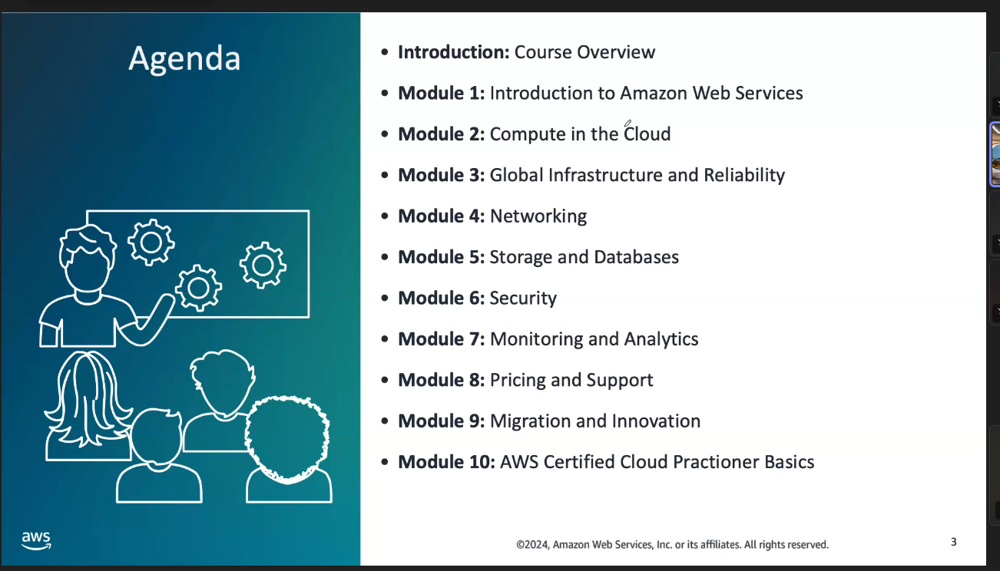
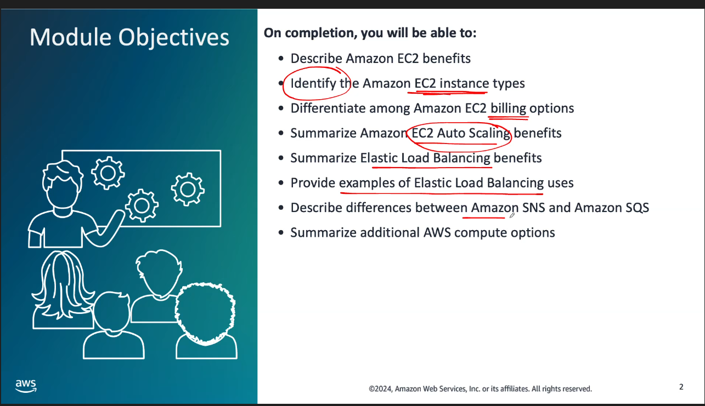

- [Mục lục](#mục-lục)
- [Compute in Cloud](#compute-in-cloud)

# Mục lục

# Compute in Cloud

- Amazon EC2 (Amazon Elastic Compute Cloud)
- Instance type:

  - General purpose
  - Compute optimized
  - Memory Optimized
  - Accelerated computing
  - Storage optimized

- Amazon simple Notification Service(Amazon SNS)
  - publicer : message to the topic
  - subcriber: receive from topic
- Amazon Simple Queue Service
  - Send, Store , receive between component
  - Queue message don't require service is avaiable
- Amazon Elastic Container Service ( Amazon ECS)
- Amazon Elastic Kurbernet Service ( Amazon EKS)
- AWS Fargate
- AWS outposts
- Amazon Virtual Private Cloud (Amazon VPC)

- Amazon Simple Storeage Service(S3):
  - store object in bucket, max one object is 5 TB
  - set per,issions to control access object
  -
- Oject Storage: each object consist of data, metadata, key

- Amazon Elastic File System (EFS)
  - Store data in a scalable file system
- Amazon Elastic Block Store (EBS)

https://www.examtopics.com/exams/amazon/aws-certified-cloud-practitioner/

https://evantage.gilmoreglobal.com/reader/books/100-ACPEXX-37-EN-SG-E/pageid/182