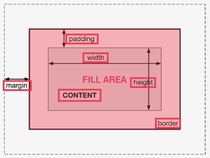

# Mục Lục

- [Mục Lục](#mục-lục)
- [CSS Box](#css-box)

# CSS Box 
)

- Content: text, image ,...
- padding: transparent area around the content inside of the box 
- border: goes around the padding and the content
- margin: space between boxes
- fill area: area that gets filled with background color or background image