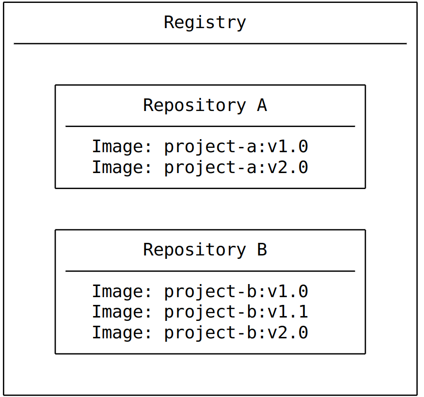

- [Mục Lục](#mục-lục)
- [Docker command](#docker-command)
  - [What is container](#what-is-container)
  - [What is image](#what-is-image)
  - [What is registry](#what-is-registry)
    - [Registry vs Repository](#registry-vs-repository)
- [Building Image](#building-image)
  - [Under standing the image layer](#under-standing-the-image-layer)
  - [Writting dockerfile](#writting-dockerfile)
  - [BUILD, TAG, AND PUBLISH an Image](#build-tag-and-publish-an-image)
    - [build image](#build-image)
    - [Tagging images](#tagging-images)
    - [Multi-stage builds](#multi-stage-builds)

# Mục Lục

# Docker command

```docker
-----------------------------------------------------------------------
** Run image **

`docker run -d -p 8080:80 docker/welcome-to-docker`
params:  -d is detached mode ->  run in background mode and return id of container when it runs instead of show output of container in terminal
         -p is port, 8080 is host in server, 80 is port of container use to listen


-----------------------------------------------------------------------
`docker ps (process status) -> list container is running`
`docker ps -a  -> all container`
`docker stop <container-id> -> stop container`
`docker image ls -> list downloaded image = docjer images`
`docker image history <repo>` -> This output shows you all of the layers, their sizes, and the command used to create the layer, each layer in dockerfile is one layer, can use --no-trunc to show all command


-----------------------------------------------------------------------
** Search Image **
`docker search .....`

-----------------------------------------------------------------------

** Pull image **
`docker pull .....`
-----------------------------------------------------------------------
** Build image **
`docker build -t YOUR_DOCKER_USERNAME/docker-quickstart . ` (ensure . at last command to find docker file)
can add tag label
`docker build -t YOUR_DOCKER_USERNAME/docker-quickstart:1.0 .`


----------------------------------------------------------------------
** Tag docker image **
`docker tag YOUR_DOCKER_USERNAME/docker-quickstart YOUR_DOCKER_USERNAME/docker-quickstart:1.0`
-----------------------------------------------------------------------
** PUSH to Docker Hub **
`docker push YOUR_DOCKER_USERNAME/docker-quickstart:1.0`


-----------------------------------------------------------------------
** Docker Compose **
`docker compose up -d --build`  -> buld docker , -d: detach mode, --build: rebuild container from image in file docker-compose.yml as when as it exists.

docker compose down -> remove everything

By default, volumes aren't automatically removed when you tear down a Compose stack. The idea is that you might want the data back if you start the stack again.

If you do want to remove the volumes, add the --volumes flag when running the docker compose down command:
docker compose down --volumes

-----------------------------------------------------------------------
** Run container **
`docker run --name=<container-name> -ti node-base`
- it: -t create a terminal pseudo (Pseudo-TTY) for container
      -i : interactive mode -> connect and interact with container when it start up,instead of stop immediately

-----------------------------------------------------------------------
** Check container logs **
`docker logs node-app-v1`
-----------------------------------------------------------------------
** Building image **
`docker build .`
- The final . in the command provides the path or URL to the build context. At this location, the builder will find the Dockerfile and other referenced files.

-----------------------------------------------------------------------
To tag an image during a build, add the -t or --tag flag:
`docker build -t my-username/my-image .`

-----------------------------------------------------------------------
If you've already built an image, you can add another tag to the image by using the docker image tag command:

`docker image tag my-username/my-image another-username/another-image:v1`

-----------------------------------------------------------------------
Push docker to a registry:
`docker push my-username/my-image`


-----------------------------------------------------------------------


-----------------------------------------------------------------------


-----------------------------------------------------------------------


-----------------------------------------------------------------------


-----------------------------------------------------------------------


```

## What is container

Container is isolate processes for each of your app component. Each component - the frontend React app, the Python API engine, and the database - runs in its own isolated environment, completely isolated from everything else on your machine.

Self-contained. Each container has everything it needs to function with no reliance on any pre-installed dependencies on the host machine.
Isolated. Since containers are , run in isolation, they have minimal influence on the host and other containers, increasing the security of your applications.
Independent. Each container is independently managed. Deleting one container won't affect any others.
Portable. Containers can run anywhere! The container that runs on your development machine will work the same way in a data center or anywhere in the cloud!

## What is image

A container image is a standardized package that includes all of the files, binaries, libraries, and confinguration to run container
Two principle of image:

- Images are immutable. Once an image is created, it can't be modified. You can only make a new image or add changes on top of it.
- Container images are composed of layers. Each layer represents a set of file system changes that add, remove, or modify files.

## What is registry

An image registry is centralize location for storing and sharing your container image. It can be either public or private
Some contrainer registry: Amazon elastic Container registry(ECR), GitLab container registry etc.

### Registry vs Repository

- A registry is centralized location that stores and manages container image
- Repository is a collection of related container image within a registry
  

# Building Image

## Under standing the image layer

- Image Layers: each layer contains a set of file system changes- additions,deletions, or modifications.
  - The first layer adds basic commands and a package manager, such as apt
  - The second layer installs a python runtime and pip for dependency management
  - The third layer copies in an appication's specific requirements.txt file
  - The fourth layer installs that application's specific dependencies
  - The fifth layers copies in the actual source code of the application
- normally use dockerfile to create image layers, can create layner manually

```docker
  docker run --name=base-container -ti ubuntu
  // root@d8c5ca119fcd:/#
  apt update && apt install -y nodejs
  node -e 'console.log("Hello world!")'
  docker container commit -m "Add node" base-container node-base
  docker image history node-base
  docker run node-base node -e "console.log('Hello again')"
  docker rm -f base-container
  docker run --name=app-container -ti node-base
  echo 'console.log("Hello from an app")' > app.js
  node app.js
  docker container commit -c "CMD node app.js" -m "Add app" app-container sample-app
  docker image history sample-app
  docker run sample-app
  docker rm -f app-container
```

## Writting dockerfile

A dockerfile is a text base document that's used to create a container image.
Example:

```dockerfile
FROM python:3.12
WORKDIR /user/local/app

COPY requirements.txt ./
RUN pip install --no-cache-dir -r requirements.txt
COPY src ./src
EXPOSE 5000
RUN useradd app
USER app

CMD ['uvicorn' ,'app.main:app', '--host','0.0.0.0', '--port','8000']

```

- `FROM <image>` - this is specifies the base image that the build will extend.
- `WORKDIR <path>` - this instruction specifies the "working directory" or the path in the image where files will be copied and commands will be executed.
- `COPY <host-path> <image-path>` - this instruction tells the builder to copy files from the host and put them into the contain`er image.
- `RUN <command>` - this instruction tells the builder to run the specified command.
- `ENV <name> <value>` - this instruction sets an environment variable that a running container will use.
- `EXPOSE <port-number>` - this instruction sets configuration on the image that indicates a port the image would like to expose.
- `USER <user-or-uid>`- this instruction sets the default user for all subsequent instructions.
- `CMD ["<command>", "<arg1>"]` - this instruction sets the default command a container using this image will run.


Containerize new projects quickly with docker init

The docker init command will analyze your project and quickly create a Dockerfile, a compose.yaml, and a .dockerignore, helping you get up and going

## BUILD, TAG, AND PUBLISH an Image

- Building images - the process of building an image based on a Dockerfile
- Tagging images - the process of giving an image a name, which also determines where the image can be distributed
- Publishing images - the process to distribute or share the newly created image using a container registry

### build image
- `docker build .` `.` in the command provides the path or URL to the build context. At this location, the builder will find the Dockerfile and other referenced files.

### Tagging images
` [HOST[:PORT_NUMBER]/]PATH[:TAG] ` 
- `HOST`: The optional registry hostname where the image is located. If no host is specified, Docker's public registry at docker.io is used by default.
- `PORT_NUMBER`: The registry port number if a hostname is provided
- `PATH`: The path of the image, consisting of slash-separated components. For Docker Hub, the format follows [NAMESPACE/]REPOSITORY, where namespace is either a user's or organization's name. If no namespace is specified, library is used, which is the namespace for Docker Official Images.
- `TAG`: A custom, human-readable identifier that's typically used to identify different versions or variants of an image. If no tag is specified, latest is used by default.
  
### Multi-stage builds
- 