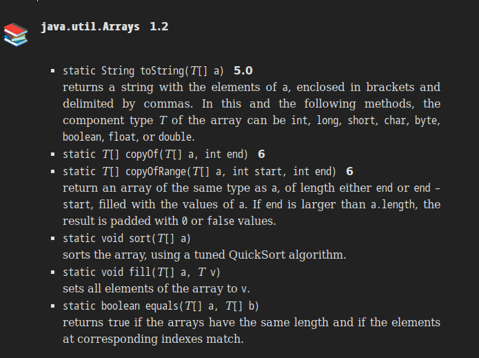

# Mục Lục

- [Mục Lục](#mục-lục)
- [DATA TYPES](#data-types)
  - [Integer types](#integer-types)
  - [Floating-Point Type](#floating-point-type)
  - [Char type](#char-type)
  - [Boolean type](#boolean-type)
- [Variable and Constants](#variable-and-constants)
  - [Declare variable](#declare-variable)
  - [Constant](#constant)
  - [Enumerate type](#enumerate-type)
- [Operator](#operator)
  - [Arithmetic](#arithmetic)
  - [Conversions between Numeric Types](#conversions-between-numeric-types)
  - [Increment and Decrement Operators](#increment-and-decrement-operators)
  - [Conditional Operator](#conditional-operator)
  - [Switch Expression](#switch-expression)
- [String](#string)
- [INPUT AND OUTPUT](#input-and-output)
  - [Reading Input](#reading-input)
  - [File Input and Output](#file-input-and-output)
- [Block](#block)
- [Loop](#loop)
- [Big Integer](#big-integer)
- [Array](#array)
  - [for loop](#for-loop)
  - [Array copying](#array-copying)
  - [Command Line Arguments](#command-line-arguments)
  - [Array Sorting](#array-sorting)
  - [Multidimensional Array](#multidimensional-array)
    - [Ragged Arrays](#ragged-arrays)
- [Object and Class](#object-and-class)
  - [Introduction Object Oriented Programming](#introduction-object-oriented-programming)
    - [Class](#class)
    - [Object](#object)
    - [Identifying Classes](#identifying-classes)
    - [Relationships between Classes](#relationships-between-classes)
  - [Using Predefined Classes](#using-predefined-classes)
    - [Objects and Object Variables](#objects-and-object-variables)
    - [Mutator and Accessor Method](#mutator-and-accessor-method)
  - [Defining Your Own Classes](#defining-your-own-classes)
    - [First Step with Constructor](#first-step-with-constructor)
    - [Declaring Local Variables with var](#declaring-local-variables-with-var)
    - [Working with null Reference](#working-with-null-reference)
    - [Implicit and explicit arguments](#implicit-and-explicit-arguments)
    - [Benefit of Encapsulation](#benefit-of-encapsulation)
    - [Class-based access Privilage](#class-based-access-privilage)
    - [Private methods](#private-methods)
    - [Final Instance Field](#final-instance-field)
  - [Static field and method](#static-field-and-method)
    - [static fields](#static-fields)
    - [static constants](#static-constants)
    - [Statuc method](#statuc-method)
    - [Factory Method](#factory-method)
    - [The main method](#the-main-method)
    - [Method parameters](#method-parameters)
  - [Object construction](#object-construction)
    - [OverLoading](#overloading)
    - [Default Field Initialization](#default-field-initialization)
    - [Constructor with no arguments](#constructor-with-no-arguments)
    - [initialize block , static initialize block](#initialize-block--static-initialize-block)
  - [Records (page 294,295)](#records-page-294295)
    - [the record concept](#the-record-concept)
    - [Constructor: Canonical, Compact, and custom](#constructor-canonical-compact-and-custom)
  - [Package](#package)
    - [Package name](#package-name)
    - [Class Importation](#class-importation)
    - [Static import](#static-import)
    - [Addition of a class into a package](#addition-of-a-class-into-a-package)
    - [Class Path](#class-path)
    - [Setting class Path](#setting-class-path)
  - [Jar File (page 315)](#jar-file-page-315)
    - [Creating JAR files](#creating-jar-files)
    - [Manifest (page 320)](#manifest-page-320)
  - [Document Command (page 330)](#document-command-page-330)
    - [Class Comment](#class-comment)
  - [Class design hints](#class-design-hints)
- [Inheritance](#inheritance)
  - [Classes, Superclasses and Subclasses](#classes-superclasses-and-subclasses)
    - [Defining subclasses](#defining-subclasses)
    - [Overriding methods](#overriding-methods)
    - [Polymorphism](#polymorphism)
    - [UnderStanding Method call](#understanding-method-call)
    - [Preventing Inheritace](#preventing-inheritace)
    - [toString Method](#tostring-method)
  - [Generic Array Lists](#generic-array-lists)


# DATA TYPES
## Integer types

1. Four type for integer:
   - byte : 1 byte
   - short: 2 bytes
   - int  : 4 bytes
   - long : 8 bytes

## Floating-Point Type

1. Two Floating-Point types
   - float: 4 bypes
   - double:8 bytes

## Char type
- 'A' => Char type, "A" => String type

## Boolean type
Cannot convert between integers and boolean values

# Variable and Constants
## Declare variable
- declare variable `data type + name variable;`
- variable is case sentitive => hireDay != hireday
- type of variable can be inferred from initial value => use keyword `var` to declare
  -  example `var x = 5` => x is integer
## Constant
- can declare CONSTANT with key word `final`
  - example: `final double CM_PER_INCH = 2.54;`
- can declare CONSTANT in class and outside main function => class CONSTANT, can use from other class 
  - example: other class can access by use  `Constants.CM_PER_INCH`
      ```java
         class Constants{ 
            public static final double CM_PER_INCH = 2.54;
         }
         
      ```
## Enumerate type
- `enum Size { SMALL, MEDIUM, LARGE, EXTRA_LARGE}` => access Size.LARGE, can hold only one of the values listed in type declaration 


# Operator
## Arithmetic 
- operator `%` can return negative 
  - example 
      ```java 
         public static void main(String args){
            public int x = -10;
            System.out.print(x%7);  // result is -3
            System.out.print(Math.floorMod(x,7)); // result is 4
            System.out.print(Math.floorMod(x,-7));  // result is -3
         }
      ```
## Conversions between Numeric Types
When two values are combined with a binary operator (such as n + f where n is an integer and f is a floating-point value), both operands are converted to a common type before the operation is carried out. 
   - If either of the operands is of type double, the other one will be converted to a double. 
   - Otherwise, if either of the operands is of type float, the other one will be converted to a float. 
   - Otherwise, if either of the operands is of type long, the other one will be converted to a long. 
   - Otherwise, both operands will be converted to an int.

## Increment and Decrement Operators
```java
   int x = 7;
   int y =  7;
   int a = 2* x++;  // x = 8;a = 14
   int b = 2* ++y;  // y= 8; b = 16
```

## Conditional Operator 
- `condition ? expression_1 : expresstion_2` evaluate expression_1 if condition is True else expression_2

## Switch Expression

```java
   enum Size { SMALL, MEDIUM, LARGE, EXTRA_LARGE };
   Size itemSize = Size.MEDIUM;
   String label = switch (itemSize)
   {
      case SMALL -> "S"; // no need to use Size.SMALL 
      case MEDIUM -> "M";
      case LARGE -> "L";
      case EXTRA_LARGE -> "XL";
      default ....
   }; 
   //label -> M

```
- When selector is enum, don't have case for all constants, => need a default
- if selector is `null` => add case `null` because default does not match `null` 

# String 
   - StringBuilder()
   -  use ``` """   ..... """ to declare a Text Blocks;


# INPUT AND OUTPUT
## Reading Input 
   - `Scanner`
   ```java
      Scanner in = new Scanner(System.in);
      System.out.print("What is your name?");
      String name = in.nextLine();  // read line of output 
      String age = in.nextInt(); // read integer 
      String name = in.next(); // read a single word not contain a whitespace
   ```
## File Input and Output 

- To read from a file
   ```java 
      Scanner in = new Scanner(Path.of("myfile.txt"));
   ```

- To write a file -> construct a PrintWriter object
   ```java
      PrintWriter out = new PrintWriter("MyFile.txt"); //write to the file
      FileWriter out = new FileWriter("Myfile.txt", true); //append to the file
   ```


# Block
- A Block or compound statement, consists a number of java statements. surrounded by a pair of braces.
- Block define the scope of your variables 

# Loop
- for, while, break, continue,...

# Big Integer 
BigInteger add(BigInteger other) 
BigInteger subtract(BigInteger other) 
BigInteger multiply(BigInteger other) 
BigInteger divide(BigInteger other) 
BigInteger mod(BigInteger other) 
BigInteger pow(int exponent) return the sum, difference, product, quotient, remainder, and power of this big integer and other.
# Array

Declare an array variable by specifying the `array type + [] + variable name` 
   ```java
      int[] a; or int a[];
      int[] a = new int[100]; or var a = new int[100];
      int[] price = {1,2,3,4};
      var price = new arraytype[0]; or new arraytype[] {} // this is legal to have array with length 0
      // notice the array with length 0 is not the same as null 
   ```

## for loop
- `for {variable : collection} statement; `
- Note: the loop variable of the for each loop traverses the element of array, not the index values 

## Array copying 
- you can copy an array variable into another, but both variable refers to the same array

```java
   int[] a = {1,2,3,4,5};
   var b = a;
   b[0]= 12; // a[0] = 12
```

- if you actually want to copy all values of one array to new array, we use the copyOf method of Array class;
```java
   int[] arraycopy = Arrays.copyOf(origin, origin.length);  
```

## Command Line Arguments 
- ` java Main.java -g Hello World`  => args = ["-g","Hello", "World"];


## Array Sorting
- use sort method of Array class `Arrays.sort(a);`

- 

## Multidimensional Array 
- A “for each” loop does not automatically loop through all elements in a two-dimensional array. Instead, it loops through the rows, which are themselves one-dimensional arrays. To visit all elements of a two-dimensional array a, nest two loops

### Ragged Arrays
   - Java has no multidimensional arrays at all, only one-dimensional arrays. Multidimensional arrays are faked as “arrays of arrays.”
```java
   final int NMAX = 10;
   int[][] odds = new int[NMAX + 1][]
   for (int n = 0;n<=NMAX;n++){
      odds[n] = new int[n+1];
   }
```

# Object and Class 
##  Introduction Object Oriented Programming 
### Class
- The bits of data in object are called its `instance field`.
- And the producers that operate on the data are called its `method`.
- Class can be built by extending other class. Java, in fact, comes with a "cosmic superclass" called Object. All other classes extends this class.
- WHen you extends existing class, the new class have all properties and method of the class you extends. You then supply new methods and instance fields that apply to your new class only. => called `inheritance".


### Object 
To work with OOP, you should be able to identify three key characteristic of Object
  - The Object's behavior - What can you do with this object, or what methods can you to apply it?
  - The Object's state - how does the object react when you invoke those methods?
  - The Object's identity - how is the Object distinguished from others that may have the same behavior and state

- The behavior of an object is defined by the methods that you can call.
- Each object stores information about what it currently looks like. This is the object’s state. An object’s state may change over time, but not spontaneously. A change in the state of an object must be a consequence of method calls. (If an object's state changed without a method call on that object, someone broke encapsulation.)
- The state of an object does not completely describe it, because each object has a distinct identity. For example, in an order processing system, two orders are distinct even if they request identical items. Notice that the individual objects that are instances of a class always differ in their identity and usually differ in their state.
- These key characteristics can influence each other. For example, the state of an object can influence its behavior. (If an order is “shipped” or “paid,” it may reject a method call that asks it to add or remove items. Conversely, if an order is “empty”—that is, no items have yet been ordered—it should not allow itself to be shipped.)


### Identifying Classes
### Relationships between Classes 

The most common relationships between classes are 
- Dependence ("uses-a"): A class depend another class, example Order depends Account because Order objects need to access Account objects to check for credit status
- Aggregation("has-a"): for example, an Order object contains Item objects. Containment means that objects of class A contain objects of class B.
- Inheritance("is-a"): For example, a RushOrder class inherits from an Order class. The specialized RushOrder class has special methods for priority handling and a different method for computing shipping charges, but its other methods, such as adding items and billing, are inherited from the Order class. In general, if class D extends class C, class D inherits methods from class C but has more capabilities


## Using Predefined Classes 
### Objects and Object Variables 
- use `Constructors` to construct new instance. A constructor is a special method whose purpose is to construct and initialize objects.
```java
   startTime = new Date()  //Wed Nov 06 23:09:55 ICT 2024
   // other class LocalDate is useful for human readable 
   LocalDate newYearsEve = LocalDate.of(1999, 12, 31); // 1999-12-31
```

### Mutator and Accessor Method
- Mutator method -> Object is change when invoke method
- Accessor method -> Method that only access the object without modifying them


## Defining Your Own Classes

The simple form for a class defination in Java is
```java
class ClassName {
   field1
   field2
   constructor1
   constructor2

   method1
   method2
}

```
### First Step with Constructor 
- A constructor has the same name as the class
- A class can have more than one constructor 
- A constructor can have zero, one or more parameters
- A constructor has no return value 
- A contructor is always called with the nre operator 
!notice : Be careful not to introduce local variables with the same names as the instance fields
The constructor declares local variables name and salary. These variables are only accessible inside the constructor. They shadow the instance fields with the same name. Some programmers accidentally write this kind of code when they type faster than they think, because their fingers are used to adding the data type. This is a nasty error that can be hard to track down. You just have to be careful in all of your methods to not use variable names that equal the names of instance fields.
```java
   public Employee(String n, double s, . . .)
   {
      String name = n; // ERROR
      double salary = s; // ERROR
      . . .
   }
```


### Declaring Local Variables with var
Declare local variables with the `var` keyword instead of specifying their type, provided their type can be inferred from can be inferred from the inittial value.
Example:
```java
   Employee harry = new Employee("Harry Hacker", 50000, 1989, 10, 1);
   var harry = new Employee("Harry Hacker", 50000, 1989, 10, 1); // should use  when data type of right-hand side is obvious 
``` 

### Working with null Reference
- primitive type is never null
- object can reference to null

Method convenience:
```java
   name = Objects.requireNonNullElse(n, "unknown");
```

### Implicit and explicit arguments
- explicit arguments is argument the method is recieve in parenthese
- implicit arguments refer to object of type -> this keyword
### Benefit of Encapsulation
- Mutator method can perform error checking
- Becarefull not to write accessor methods that return references to mutable objects.-> 2 variable can refer to the same object -> object can be change -> break encapsulation

### Class-based access Privilage
- a method can access the private data of the object which it is invoked. -> a method of Employee class is permitted to access the private fields of any object type Employee

### Private methods 
- use private keyword to set private
### Final Instance Field
```java
   class Employee{
      private final String name;
   }
```
- the final keyword useful for primitive value and Class Immutable (A class is Immutable if none of its method ever mutate its object)
## Static field and method
### static fields
- static field is class field,
```java
   class Employee{
      private static int nextId = 1;
      private int id;
   }
// nextId field is share for all instance of the class
```

### static constants
```java
   class Employee{
      private static final int nextId = 1;
   }

```

### Statuc method
- static method does not operate on an object, but it can access a static field
- should be use class name to call static method instead of object

### Factory Method
-> another common use for static methods.  Instead use constructor example LocalDate.of()
- 3 three reasons to prefer a factory method over a constructor
  - can't give  names to constructor. because constructor has same name as Class
  - when you use constructor, you can not define a type for constructor
  - A constructor always constructs a new object. You may want to share instances. For example, the Integer.valueOf factory method yields the same instance when you call it twice with the same small argument.
### The main method
- inpreview of Java 21 can have more than one main method 
### Method parameters
- Java programming language always uses call by value (with object -> pass value is object reference )
Summary:
- A method cannot modify a parameter of a primitive type (that is, number types, char, or boolean).
- A method can change the state of an object parameter.
- A method cannot make an object parameter refer to a new object.
  
## Object construction
### OverLoading
- overloading occurs if serveral methods have the same name in this case
- Java allows you to overload any method—not just constructor methods. Thus, to completely describe a method, you need to specify its name together with its parameter types. This is called the signature of the method.
- The return type is not part of the method signature. That is, you cannot have two methods with the same names and parameter types but different return types.
### Default Field Initialization
- If you don't set field explicitly in constructor, it is automaticaly set to a default value: number is 0, boolean is false and object reference is null 
### Constructor with no arguments
- a constructor don't have to a parameters
- if class not have to a constructor -> instance field set to default

### initialize block , static initialize block
``` java
   class Employee
{
   private static int nextId;

   private int id;
   private String name;
   private double salary;

   // object initialization block
   {
      id = nextId;
      nextId++;
   }

   public Employee(String n, double s)
   {
      name = n;
      salary = s;
   }

   public Employee()
   {
      name = "";
      salary = 0;
   }
   // static initialization block
   private static RandomGenerator generator = RandomGenerator.getDefault();
   static
   {
      nextId = generator.nextInt(10000);
   }
}  
```
## Records (page 294,295)
### the record concept 
A record is a special form of a class whose state is immutable and readable by the public. To declare a record, provide the name and the instance variables that hold the object state. Here is how you define Point as a record:
```java
   record Point(double x, double y){

   }

   // equivalent
   // private final double x;
   // private final double y;
   // The class has a constructor 
   // Point(double x, double y) 
   // and accessor methods 
   // public double x()
   // public double y() 
   //Instance fields of a record are automatically final
   ____________________________
   // can add owner method to record
   record Point(double x, double y)
   {
      public double distanceFromOrigin() { return Math.hypot(x, y); }
   }

   // can not add instance field to record 
   record Point(double x, double y)
   {
      private double r; // ERROR
   }
   ______________
   // A record, like any class, can have static fields and methods: 
    record Point(double x, double y)
   {
      public static Point ORIGIN = new Point(0, 0);
      public static double distance(Point p, Point q)
      {
         return Math.hypot(p.x - q.x, p.y - q.y);
      }
   }

```
Use a record instead of a class for immutable data that is completely represented by a set of variables. Use a class if the data is mutable, or if the representation may evolve over time. Records are easier to read, more efficient, and safer in concurrent programs.

### Constructor: Canonical, Compact, and custom
 
``` java 
   record Range(int from, int to)
   {
      public Range // Compact form, normalizing parameters 
      
      {
         if (from > to) // Swap the bounds
         {
            int temp = from;
            from = to;
            to = temp;
         }
      }
   } 
   record Range(int from, int to)
   {
      public Range(int from, int to) // legal, but more work than a compact constructor
      {
         if (from <= to)
         {
            this.from = from;
            this.to = to;
         }
         else
         {
            this.from = to;
            this.to = from;
         }
      }
   }
``` 

## Package
- Java allows you to group classes in a collection called package

### Package name 
- Main reason to use package is guarantee the uniqueness of class names.
- guarantee a unique package name, use internaet domain name written in reverse. then use subpackage for different project
- From the compiler, no relationship between nested packages. ex: java.util and java.util.jar

### Class Importation
- A class can use all class from its own package and all public classes from other packages.
- Can access the public classes in another package in two ways.
  -  The first is simply to use fully qualified name-> is package name followed by the class name. (shoud not be used)
  -  use the import statement, ex: import java.time.*;

### Static import
```java
   import static java.lang.System.out;
```
- so use can use the method and field of class but not need class name

### Addition of a class into a package
- To place classes inside a package, put the name of the package at the top of your source file, before the code that defunes the classes in the packages.( the structure of package is the same with the directory.)
```java
   package com.horstmann.corejava;

   public class Employee
   {
      . . .
   }
```

### Class Path
- Example: /home/user/classdir:.:/home/user/archives/archive.jar

### Setting class Path
- specify class path with option `-classpath` or `-cp` or `--class-path`
-  `java -classpath /home/user/classdir:.:/home/user/archives/archive.jar MyProg`
-  Using the -classpath option is the preferred approach for setting the class path. An alternate approach is the CLASSPATH environment variable. The details depend on your shell. With the Bourne Again shell (bash), use the command 
    export CLASSPATH=/home/user/classdir:.:/home/user/archives/archive.jar

## Jar File (page 315)
### Creating JAR files
- `jar cvf jarFileName file1 file2...`
- General : jar options file1 file2 (315-316)
### Manifest (page 320)
- each jar file has manifest file describe jar file 

## Document Command (page 330)
- Each /** . . . */ documentation comment contains free-form text followed by tags. A tag starts with an @, such as @since or @param.

### Class Comment
- must after import and before the class definition
- .... 

## Class design hints
- Always keep data private
- Always initialize data
- Don't use too many basic types in a class
- Not all fields need individual field accessor and mutators
- Break up classes that have too many responsibilities 
- Make the names of your classes and methods reflect their responsibilities.
- Prefer immutable class 

# Inheritance

## Classes, Superclasses and Subclasses

### Defining subclasses
```java
   public class Manager extends Employee 
   {
      add method and fields
   }
```

### Overriding methods
- user keyword `super(...argument)`
  
### Polymorphism
- a super class can refer to subclass, but in contrast, it not work and throw error
example
```java
   class Manager extends Employee{

   }

   Employee staff[] = new Employee[3];
   var boss = new Manager();
   staff[0] = boss; // work well but staff[0] is employee, so it can't be use method of Manager class, but boss can
   // but if the method of Manager class override method of employee class -> it call method of Manager class
```
### UnderStanding Method call
- dynamic binding: 
- a type object variable (reference value) and actual type of object
```java
   Employee e = new Manager();
   // e -> is reference of type Employee (reference type), but actually it refer to Manager object in memory , polimorphism
   // when you call method, e.work() -> it call method of actual object it refer to, -> so it call method work of Manager class (if work method of Manager is override work method of employee class), if if Manager class not have work() method -> compiler would be find in Employee Method -> dynamic binding. 
```

### Preventing Inheritace 
if you don't want a class can be inherted, you can declare a class with `final` keyword


### toString Method
- Whenever an object is concatenated with a string by the + operator, Java compiler automatically invokes the toString method to obtain a string reperesentation of the object.


## Generic Array Lists
- ArrayList is a generic class with type parameter. To specify the type of ArrayList hold, put it in angle bracket 
Ex:
```java
   ArrayList<Employee> emp = new ArrayList<Employee>(); // declare array with no fixed number element 
   emp.ensureCapacity(100);  // -> set fixed element is 100
   emp.add(new Emp(....));   // -> add Element to array
   emp.size(); // return size 
   emp.trimToSize() // fix number element of array is current number element of array
```
