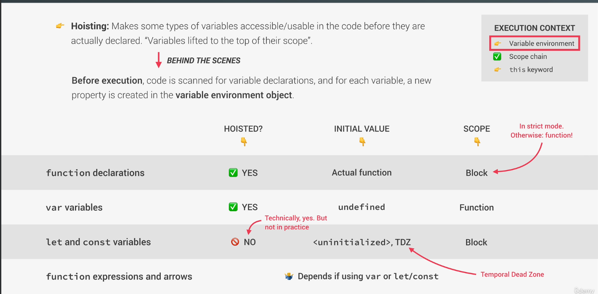

# Mục Lục

- [Mục Lục](#mục-lục)
- [JavaScript Engine](#javascript-engine)
  - [Compilation](#compilation)
  - [Interpretation](#interpretation)
  - [Just in time(JIT) compilation](#just-in-timejit-compilation)
- [Execution contexts amd the Call Stack](#execution-contexts-amd-the-call-stack)
  - [Scope and The Scope chain](#scope-and-the-scope-chain)
    - [Global scope](#global-scope)
    - [Function scope](#function-scope)
    - [Block scope](#block-scope)
- [Hoisting and the TDZ (Temperal dead zone)](#hoisting-and-the-tdz-temperal-dead-zone)
- [`this` keyword](#this-keyword)
- [Primitive vs Object (Primitives vs Reference types)](#primitive-vs-object-primitives-vs-reference-types)
- [Link to script file](#link-to-script-file)
- [Naming variables](#naming-variables)
  - [Rule of Naming](#rule-of-naming)
- [Primitive vs Object](#primitive-vs-object)
- [Value](#value)
  - [7 Primitive data type](#7-primitive-data-type)
- [Declare Variable](#declare-variable)
  - [let](#let)
  - [const](#const)
  - [var](#var)
- [Falsy and Truly values](#falsy-and-truly-values)
- [Operator](#operator)
  - [Equality Operator == \& ===](#equality-operator---)
  - [switch-case](#switch-case)
- [Strict mode](#strict-mode)
- [Functions](#functions)
  - [Functions Declarations and Expression](#functions-declarations-and-expression)
  - [Arrow function](#arrow-function)
  - [regular function and arrow function](#regular-function-and-arrow-function)
- [Arrays](#arrays)
  - [Arrays methods](#arrays-methods)
- [Object](#object)
  - [Object method](#object-method)
  - [For loops](#for-loops)
- [DOM and Events Fundamentals](#dom-and-events-fundamentals)
- [Destructure](#destructure)
  - [Destructure Array](#destructure-array)
  - [Destructure Object](#destructure-object)
- [Spread operator](#spread-operator)
- [Rest Pattern and Parameter](#rest-pattern-and-parameter)
- [Nullish Operator ( `??` )](#nullish-operator---)
- [Logical Assigment Operator](#logical-assigment-operator)
- [Set](#set)
- [Map](#map)
- [Data Structure Overview](#data-structure-overview)
  - [Source of data](#source-of-data)
- [Work with String](#work-with-string)
- [Passing argument: Values vs Reference](#passing-argument-values-vs-reference)
- [First Class and Higher-Order Functions](#first-class-and-higher-order-functions)
- [Call, Bind, Apply](#call-bind-apply)
  - [Call](#call)
  - [Apply](#apply)
  - [bind](#bind)
- [Closure](#closure)
- [Data transform with map, filter and reduce](#data-transform-with-map-filter-and-reduce)
- [find,findIndex, some, every, flat methods](#findfindindex-some-every-flat-methods)
- [Constructor Array](#constructor-array)
- [Math, BigInt](#math-bigint)
- [Date](#date)
  - [Format with Intl(Internationalization API)](#format-with-intlinternationalization-api)
- [Timer: setTimeout and setInterval](#timer-settimeout-and-setinterval)
- [Type of Events and Event Handlers: Event.preventDefault(), Events.stopPropagation](#type-of-events-and-event-handlers-eventpreventdefault-eventsstoppropagation)
- [Event Delegation (implement page navigation)](#event-delegation-implement-page-navigation)
- [Dom Traversing](#dom-traversing)
- [Passing arguments to Event Handler](#passing-arguments-to-event-handler)
- [Defer and Async Script Loading](#defer-and-async-script-loading)
- [OOP in JS](#oop-in-js)
  - [ES6 Classes](#es6-classes)
  - [Getter and Setter](#getter-and-setter)
  - [Static Method](#static-method)
  - [Object.create()](#objectcreate)
  - [Inheritance](#inheritance)
  - [Encapsulation](#encapsulation)
  - [Summary](#summary)

# JavaScript Engine
- JS Engine include `call stack` and `heap`
- `Call stack` is order funtion excute and `heap` save object 
## Compilation 
  Entire code is converted into machine code at one, and written to a binary file that can be executed by a computer
- source -> portable file: machine code // compilation 
- portable file -> Program running   // execution, can happen way after compilation

## Interpretation
Interpreter runs through the source code and executes it line by line
- Source code -> Program running   // code execution line by line 

## Just in time(JIT) compilation 
Entire code is converted into machine code at one, then executed immediately 
- source -> Machine code // compilation, not a portable file
- Machine code -> Program running // happens immediately

# Execution contexts amd the Call Stack
What's inside execution contexts 
- 1. Variable environment 
  - let, const, var declaration 
  - functions
  - `argument object` 
- 2. Scope chain 
- 3. `this` key word
Note: Arrow function don't have `this` keyword and `argument object`. Instead, they can use the argument objects object and the this keyword from their closest regular function parent 
## Scope and The Scope chain 
- Scoping -> Where can we access a certain variable and where not? 
- Lexical scoping: scopping is controlled by replacement of functions and blocks in the code 
- Scope: Space or environment on which a certain variable is declare(veriable environtment in case of functions). There is global scope, function scope, and block scope
-  Scope of a variable: Region of our code where a certain variable can be accessed 
-  Scope chain: Variable lookup in scope chain (scope has access to variable from all outer scopes, child can be access variable if it in scope of all parent..), only work upward not sideway
-  Variable lookup: When variable is not in the current scope, the engine looks up the scope chain until it finds the variable it's looking for. This is called variable lookup;
-  The scope chain is one-way street: a scope will never, ever have access to the variable of an inner scope
-  the scope chain has nothing to do with the order in which functions were called. It does not affect the scope chain at all.

 

### Global scope 
- Out side of any function or block 
- Variable declared in global scope are accessible everywhere
### Function scope
- variable can be accessible only inside function, not outside
- also called local scope
### Block scope
- variable can be accessible only inside block (block scope)
- However, this is only applies to let and const variables
- Function are also block scoped (only in strict mode)


# Hoisting and the TDZ (Temperal dead zone)
- Hoisting: makes some types of variable accessible/useable in the code before they are actually declared. Variable lifted to the top of their scope 


# `this` keyword
- this keyword/variable: Special variable that is create for every excution context(every function). Take the value of (point to) the "owner" of the function in which the this keyword is used.
- this is not static. It depends on how the functionis called, and its value is only assigned when function is actually called
  - method: this = < Object that is calling the method >
  - Simple function call: this = undefine, only valid in strict mode, otherwise: window object // we call method normal and not as a method and so not attached to any object
  - arrow function: this = < this is surrounding function (lexical this) >
  - event listener: this = < DOM element that the handler is attached to >
  


# Primitive vs Object (Primitives vs Reference types)
- Primitive types varibale save in call stack, Identifier point to address, which hold values of variable 
- Object save in Heap, identifier point to address, which hold to address value of object in heap 


# Link to script file

- you can use `<script>` tag in html file to write javascript
- you can you `<script src='path to js file'></script>` in html to use js file
- js file usually write file in

# Naming variables

- Style of naming usually using in JS is camelCase `ex let firstName`

## Rule of Naming

- variable name can't start with a number
- variable name can only contain letter, number, underscore or dollar sign
- variable name can't equals key word in JS
- if variable is CONSTANT, write it UPPER CASE
- variable name should be describe the value it hold

# Primitive vs Object

# Value

- Value is a Object or Primitive
- Value has type, not variable -> data types are determined automatically

## 7 Primitive data type

- `number` : Floating point number
- `string` : Sequence of characters
- `Boolean` : true or false
- `undefined` : value taken by a variable that is not yet defined ('empty valuue') => variable declare but not assign value
- `null` : Also means 'empty value'
- `Symbol`(ES2015): Value is that unique and can't be changed
- `BigInt`(ES2020): Large integer than Number type can be hold

Use `type of` to check data type of value; (special type of null is object)

# Declare Variable

- can assign value for variable, but if not use let, const, var -> this is global variable

## let

- value of variable can be change

## const

- value of variable can't be change
- must assign value when declare

## var

- value of variable can be change
- var don't have block scope
- declarable with var, will create property on the global window object.


# Falsy and Truly values

- five falsy values: 0, '', undefined, null, NaN.

# Operator

## Equality Operator == & ===

```js
"18" == 18; // true
"18" === 18; // false
```

## switch-case

```js
const day = "wednesday";
switch (day) {
  case "monday":
    console.log("Plan course structure");
    console.log("Go to coding meetup");
    break;
  case "tuesday":
    console.log("Prepare theory videos");
    break;
  case "wednesday":
  case "thursday":
    console.log("Write code examples"); //-> fallthrough , code excuted until break or return;
  case "friday":
    console.log("Record videos");
    break;
  case "saturday":
  case "sunday":
    console.log("Enjoy the weekend");
    break;
}
```

- if not stop when each case -> fallthrough

# Strict mode

- use `'use strict';` in beginning to active strict mode

# Functions

## Functions Declarations and Expression

```js
function calcAge1(birthYear) {
  return 2024 - birthYear;
}

const age1 = calcAge1(1991);
const calcAge2 = function (birthYear) {
  return 2024 - birthYear;
};
const age2 = calcAge2(1991);
```

- The different is we can call function declarations before they are defined in the code.

## Arrow function

```js
  const calcAge3 = birthYear => 2024 - birthYear;
  const yearsUntilRetirement = (birthYear , firstName) => {
    return .....
  }
```


## regular function and arrow function
- arrow function don't have parameter `arguments`


# Arrays

- declare and access to arrays

```js
const friends = ["123", "1234", "4444"]; //declare
const years = new Array(1991, 1992, 1993); //declare
friends[1] = "1234"; // access
friends = [1, 2]; // error ->  because declare with const
```

## Arrays methods

- push() -> add element to the end of array
- unshift() -> add element to begin of array
- pop() -> remove last element of array
- shift() -> remove first element of array
- indexOf(element) -> return position of element in array ( begin from 0)
- includes(value) -> return true if value in array, and opposite

# Object

```js
const jonas = {
  firstName: "Jonas", // property
  lastName: "Scheman",
  age: 2037 - 1991,
  friends: ["Miacal", "Peter"],
};
console.log(jonas.firstName); // Jonas
console.log(jonas["firstName"]); // Jonas
```

- use dot `object.property_name` or use brackets `object['property_name']` to access to object property
- use `object.property_name = value` or `object['property_name'] = value` to set property for object
- use `delete object.property_name` or `delete object['property_name']` to delete property

## Object method

```js
  const jonas = {
    firstName: 'Jonas',   // property
    lastName : 'Scheman',
    age : 2037-1991,
    friends : ['Miacal','Peter'],
    caclAge : function(){
      ......
    }
  }
  jonas.calcAge();
```

## For loops

# DOM and Events Fundamentals


# Destructure
## Destructure Array 
```js
const books = [
  {
    title: 'Algorithms',
    author: ['Robert Sedgewick', 'Kevin Wayne'],
    publisher: 'Addison-Wesley Professional',
    publicationDate: '2011-03-24',
    edition: 4,
    keywords: ['computer science', 'programming', 'algorithms', 'data structures', 'java', 'math', 'software', 'engineering'],
    pages: 976,
    format: 'hardcover',
    ISBN: '9780321573513',
    language: 'English',
    programmingLanguage: 'Java',
    onlineContent: true,
    thirdParty: {
      goodreads: {
        rating: 4.41,
        ratingsCount: 1733,
        reviewsCount: 63,
        fiveStarRatingCount: 976,
        oneStarRatingCount: 13
      }
    },
    highlighted: true
  },
  {
    title: 'Structure and Interpretation of Computer Programs',
    author: ['Harold Abelson', 'Gerald Jay Sussman', 'Julie Sussman (Contributor)'],
    publisher: 'The MIT Press',
    publicationDate: '2022-04-12',
    edition: 2,
    keywords: ['computer science', 'programming', 'javascript', 'software', 'engineering'],
    pages: 640,
    format: 'paperback',
    ISBN: '9780262543231',
    language: 'English',
    programmingLanguage: 'JavaScript',
    onlineContent: false,
    thirdParty: {
      goodreads: {
        rating: 4.36,
        ratingsCount: 14,
        reviewsCount: 3,
        fiveStarRatingCount: 8,
        oneStarRatingCount: 0
      }
    },
    highlighted: true
  },
  {
    title: 'Computer Systems: A Programmer\'s Perspective',
    author: ['Randal E. Bryant', 'David Richard O\'Hallaron'],
    publisher: 'Prentice Hall',
    publicationDate: '2002-01-01',
    edition: 1,
    keywords: ['computer science', 'computer systems', 'programming', 'software', 'C', 'engineering'],
    pages: 978,
    format: 'hardcover',
    ISBN: '9780130340740',
    language: 'English',
    programmingLanguage: 'C',
    onlineContent: false,
    thirdParty: {
      goodreads: {
        rating: 4.44,
        ratingsCount: 1010,
        reviewsCount: 57,
        fiveStarRatingCount: 638,
        oneStarRatingCount: 16
      }
    },
    highlighted: true
  },
  
];


//1.1
const [firstBook, secondBook] = books;
console.log(firstBook, secondBook);

//1.2
const [ , , thirdBook] = books;
console.log(thirdBook);

//1.3

const ratings = [['rating', 4.19], ['ratingsCount', 144584]];
const [[,rating], [,ratingsCount]] = ratings;
console.log(rating, ratingsCount);

//1.4
const ratingStars = [63405, 1808];
const [fiveStarRatings, oneStarRating,threeStarRatings] = [...ratingStars,0];
console.log(fiveStarRatings, oneStarRating,threeStarRatings);
```
## Destructure Object 
```js
  const restaurant = {
    name: 'Classico Italiano',
    location: 'Via Angelo Tavanti 23, Firenze, Italy',
    categories: ['Italian', 'Pizzeria', 'Vegetarian', 'Organic'],
    starterMenu: ['Focaccia', 'Bruschetta', 'Garlic Bread', 'Caprese Salad'],
    mainMenu: ['Pizza', 'Pasta', 'Risotto'],
    order : function (strartIndex , mainIndex){
      return [this.starterMenu[strartIndex], this.mainMenu[mainIndex]];
    },
    
    oderDelivery: function({startIndex, mainIndex, time, address}) {
      console.log()
    }

    openingHours: {
      thu: {
        open: 12,
        close: 22,
      },
      fri: {
        open: 11,
        close: 23,
      },
      sat: {
        open: 0, // Open 24 hours
        close: 24,
      },
    },
  };

  const {name , mainMenu, location} = restaurant;
  console.log(name, mainMenu, location);
  const {name: restaurantName, mainMenu: menu, location: loc} = restaurant;
  console.log(restaurantName, menu, loc);

  const {openingHours} = restaurant;
  const {fri: {open, close} } = openingHours;
  console.log(open, close);   //12,23

  const obj = { 
    a: 1,
    b: 2,
    c: 3
  };
  let a  =111;
  let b = 999;
  ({a,b} = obj);
  console.log(a,b);  // a = 1,  b = 2 

  const orderObj = {
    startIndex: 2,
    mainIndex: 2,
    time: '22:30',
    address: 'Via del Sole, 21'
  };

  restaurant.orderDelivery(orderObj);


```

# Spread operator 
`...`

```js
  const arr = [1,2,3];
  const newarr = [0,...arr];
  console.log(newarray); // [0,1,2,3]
```
Iterables: arrays , strings, maps, sets, NOT object

```js
  const str = "minh Hieu";
  const letter = [...str]; //['m','i','n','h',' ','H', 'i','e','u'];
  const restaurant = {
    name: 'Pizza',
    location: "dong da",

  }
  const HieuPizza = {...restaurant, prize: '51'}
  console.log(HieuPizza);
```


# Rest Pattern and Parameter
 
```js
  const [a,b,...others] = [1,2,3,4,5];
  console.log(others);  // 3,4,5
  function add(...numbers){
    let sum = 0;
    for(let i = 0; i<numbers.length ;i++){
        sum += numbers[i];
    }
    return sum;
  }
```


# Nullish Operator ( `??` ) 
Nullish value is `null` and `undefined`
- `??` return right-hand only if left-hand operand is `null` or `undefined` 

# Logical Assigment Operator
```js
  res1.numberGuest ||= 10; // equal res1.numberGuest =  res1.numberGuest || 10

  res1.numberGuest ??= 10; // equal res1.numberGuest = res1.numberGuest ?? 10
```


# Set 

```js 
  const orderSet = new Set(['Pasta', 'Pizza', 'Pizza', 'Risotto', 'Pasta', 'Pizza']);
  const orderSet1 = new Set([...orderSet]); // Spread inside an array
  console.log(orderSet.size);  //Pasta, Pizza, Risotto
```


# Map 
```js 
  const rest = new Map();
  rest.set('name', "MH");
  rest.set(1,"Haha");
  console.log(rest);
  console.log(rest.set(2, "Hieu"));
  console.log(rest.get(1));

  const arr = [1,2];
  rest.set(arr, "Test");
  console.log(rest.get(arr));

  rest.set(document.querySelector('h1'), 'Heading');
  console.log(rest.get(document.querySelector('h1')));  // Heading 
  console.log(rest.get('h1')); //undefine 
  console.log(rest);
```


# Data Structure Overview 
## Source of data 
  - From the program itself: Data written directly in source code (eg. status message)
  - From the UI: Data input from the user or data written in the Dom (eg. task in todo app)
  - From external source: Data fetched for example from web API (eg recipe object)
-> Simple list? -> using  Arrays or Sets
-> Key/Value pair? -> using Objects or Maps


# Work with String


# Passing argument: Values vs Reference

- primitive type pass value
- other pass reference

# First Class and Higher-Order Functions
- javascript treats functions as first-class citizens
- This means that function are simply value 
- Funtions are just another "type" of object
- Store functions in variables or properties
- Pass functions as arguments to other function
- Return functions From functions
- Call methods on functions


# Call, Bind, Apply
## Call 
```js
  call(thisArg, arg1, ..., argN)
  
```
- `thisArg`: The value to use as this when calling function. If the function is not in `strict mode` , `null`, `undefined` will be replace with the global object, and primitive values will be converted to object.
- `arg1, arg2,..., argN`: Arguments for the function

- Return value: The result of calling the function with the specified this value and arguments

## Apply
```js
  apply(thisArg, argsArray)
```

- `thisArg`: the value of this provided for the call to function. If the function is not in `strict mode` , `null`, `undefined`, will be replaced with the global object, and primitive values will be converted to objects.
- `argsArray`: An array-like object, specifying the arguments with which function should be called, or `null`, or `undefined` if no arguments should be provided to the function

- Return value: The result of calling the function with the specified this value and arguments.


## bind
```js
  bind(thisArg, arg1, ..., argN)
```

 # Closure


# Data transform with map, filter and reduce

```js
    const arr  = [1,2,3,4,5];
    const newArr = arr.map((val, i) => val*2)
    const filterArr = arr.filter(val => val>1);
    const reduceArr = arr.reduce((acc,val) => acc*val,1);
    console.log(reduceArr); //120
    console.log(filterArr); //[2,3,4,5]
    console.log(arr); //[1,2,3,4,5]
    console.log(newArr); //[2,4,6,8,10]
```

# find,findIndex, some, every, flat methods 

```js
  const movements = [200, 450, -400, 3000, -650, -130, 70, 1300];


  console.log(movements.find((mov) => mov === 450)); // 450
  console.log(movements.find((mov) => mov === 3100)); // undefined
  console.log(movements.findIndex((mov) => mov === 450)); //1
  console.log(movements.findIndex((mov) => mov === 3100)); // -1
  console.log(movements.some((mov)=> mov > 3100)); // false
  console.log(movements.some((mov)=> mov > 0));  //true
  console.log(movements.every((mov)=> mov > -5000)); //true
  console.log(movements.every((mov)=> mov > 0)); //false

  const arr = [1,2,3,[4,5],[6,7,[8,9]], 10];
  console.log(arr.flat(1));// [1,2,3,4,5,6,7,[8,9],10];
  console.log(arr.flat(2)); // [1,2,3,4,5,6,7,8,9,10];
  console.log(movements.flatMap((val) => [val,val * 2])); // [200,400,450,900,-400,-800,3000,6000,-650,-1300,-130,-260,70,140,1300,2600];
  // flatMap <=> map + flat (one level);

```

# Constructor Array 
```js 
  const x = new Array(7);
  x.fill(1,3,5);  //[empty x 3, 1, 1, empty x 2]

  const y = Array.from({length: 7}, () => 1);
  console.log(y); //[1,1,1,1,1,1,1]

  const movmentsRow = Array.from(document.querySelectorAll('.movements__value'), el => el.textContent.replace('€',''));
  console.log(movmentsRow);   //["200", "450", "-400", "3000", "-650", "-130", "70", "1300"]
```


# Math, BigInt

```js
  Math.round();  //  Returns a supplied numeric expression rounded to the nearest integer.
  Math.floor(); // Returns the greatest integer less than or equal to its numeric argument
  Math.trunc(); //Returns the integral part of the a numeric expression, x, removing any fractional digits. If x is already an integer, the result is x.
  Math.ceil();  // Returns the smallest integer greater than or equal to its numeric argument.
const y = Math.ceil()
  const n = 1231n; // bigint
  const m =  BigInt(3); //3n
  const t =  BigInt(3.7); // 3n

```

# Date

```js
  const future = new Date(2037, 10, 19, 15, 23);
  console.log(future);
  console.log(future.getFullYear());  //20237
  console.log(future.getMonth());   //10
  console.log(future.getDate());  //19
  console.log(future.getDay()); //4
  console.log(future.getHours());  //15
  console.log(future.getMinutes());//23
  console.log(future.getSeconds()); //0
  console.log(future.toISOString());
  console.log(future.getTime());
  console.log(new Date(2142256980000));
  console.log(Date.now());
  future.setFullYear(2040);
  console.log(future);
```


## Format with Intl(Internationalization API)
```js
  const now = new Date()
  console.log(now);  // Mon Oct 14 2024 22:05:17 GMT+0700 (Indochina Time)
  const nowformat = Intl.DateTimeFormat('en-US').format(now);
  // can use options
  const nowformat = Intl.DateTimeFormat('en-US').format(now);
  const options = {
      hour : 'numeric',
      minute: 'numeric',
      day: 'numeric',
      month: 'long',
      year: 'numeric',
      weekday:'long'
  }

  console.log(nowformat);  //10/14/2024
```


# Timer: setTimeout and setInterval
- setTimeout() -> execute funtion after time (one time )
- setInterval() -> execute funtion after every time (many time)


# Type of Events and Event Handlers: Event.preventDefault(), Events.stopPropagation

- ev.preventDefault() -> prevent action default of browse (example : click a link but not redirect to the link)
- ev.stopPropagation() -> prevent bubling
- Event propagation: bubling and capturing,capturing: root element -> target element, bubling: target element -> root element, but e.target is the same.
```js
  const h1 = document.querySelector('h1');
  h1.addEventListener('click', function(ev){
  this.style.backgroundColor = 'blue';

    console.log(ev.target,ev.currentTarget);
    // ev.currentTarget is h1
  })


  const headerTitle = document.querySelector('.header__title')
  headerTitle.addEventListener('click',function(ev){
    this.style.backgroundColor = 'red';
    console.log(ev.target,ev.currentTarget);
  })
  //ev.currentTarget is headerTitle

// ev.target is the same. but ev.currentTarget is not same, 


```
# Event Delegation (implement page navigation)
```js

tabsContainer.addEventListener('click', function(ev){
  // if(ev.target.classList.contains('.operations__tab--1')){
    
  // }
  const clicked = ev.target.closest('.operations__tab');
  if(!clicked) return;

  tab.forEach(t => {
    t.classList.remove('operations__tab--active');
  })
  clicked.classList.add('operations__tab--active');
  const tabActive = clicked.dataset.tab;
  console.log(tabActive);
  tabsContent.forEach(tabContent =>{
    tabContent.classList.remove('operations__content--active');
    if(tabContent.classList.contains(`operations__content--${tabActive}`)){
      console.log('call');
      tabContent.classList.add('operations__content--active');
    }
  });


})

```

# Dom Traversing
In DOM traversing, you can move in different directions:

- Down the DOM tree (Child elements): Moving from a parent element to its children.

Examples: firstChild, lastChild, children, querySelector
- Up the DOM tree (Parent elements): Moving from a child element to its parent.

Examples: parentNode, closest
- Sideways in the DOM tree (Sibling elements): Moving between elements that share the same parent.

Examples: nextSibling, previousSibling, nextElementSibling, previousElementSibling
- Common methods and properties used for DOM traversal include:

- parentNode: Returns the parent of the selected node.
- children: Returns a collection of child elements.
- firstChild and lastChild: Returns the first and last child of the element.
- nextSibling and previousSibling: Navigate to the next or previous sibling in the DOM.
- querySelector and querySelectorAll: Select elements based on CSS selectors. 

# Passing arguments to Event Handler
```js
  const handleEvent = function (ev) {
    if (ev.target.classList.contains('nav__link')) {
      const link = ev.target;
      const siblings = link.closest('.nav').querySelectorAll('.nav__link');
      const logo = link.closest('.nav').querySelector('img');
      siblings.forEach(el => {
        if (el != link) {
          el.style.opacity = this;
        }
      });
      logo.style.opacity = this;
    }
  };

  nav.addEventListener('mouseover', handleEvent.bind(0.3));
  nav.addEventListener('mouseout', handleEvent.bind(1));
```
# Defer and Async Script Loading


# OOP in JS 
- four fundamental principles of object oriented Programming
  - Abstraction: Ignoring or hiding details that don't matter, allowing us to get an overview perspective of the thing we're implementing, instead of messing with the details that don't really matter to our implementation.
  - Encapsulation: Keepong properties and methods private inside the class, so they are not accessible from outside from the class. Some methods can be exposed as a public interface(API)
  - Inheritance: Making all properties and methods of a certain class avaiable to a child class, forming a hierarchical relationship between classes. This allow us to reuse common logic and to model real-world relationships. 
  - Polymorphism: A child class can overwrite a method it inherited from a parent class.
  

```js 
      'use strict';

  const Person = function(firstName, birthYear){
      console.log(this);
      this.name = firstName;
      this.birthYear = birthYear;
  }   

  const jonas = new Person('Jonas', 1991);
  // 1. new {} is created
  // 2. function is called, this = {}
  // 3. {} linked to prototype 
  // 4. function automatically return {} 
```


## ES6 Classes
```js
  class PersonCl {
    constructor(firstName, birthYear){
        this.firstName = firstName;
        this.birthYear = birthYear;
    }

    calcAge(){
        console.log(2024 - this.birthYear);
    }
}

```
## Getter and Setter

```js 

  class PersonCl {
    constructor(fullName, birthYear){
        this.fullName = fullName;
        this.birthYear = birthYear;
    }
    set fullName(name){
        if(name !== 'Minh Hieu') alert('Not is MH')
        this._fullName = name;
    }

    get fullName(){
        return this._fullName
    }

    calcAge(){
        console.log(2024 - this.birthYear);
    }

  }

  const MH = new PersonCl('Minh Hieu', 2002);
  console.log(MH.fullName);

```


## Static Method

```js
  class PersonCl {
    constructor(fullName, birthYear){
        this.fullName = fullName;
        this.birthYear = birthYear;
    }
    static sayHi(){
        console.log("hi");
    }
}

const MH = new PersonCl('Minh Hieu', 2002);
console.log(MH.sayHi);
console.log(PersonCl.sayHi());
```


## Object.create()

```js
  const PersonProto = {
    name: "MHieu",
    calcAge: function(){
      return 2024 - this.birthYear;
    }
  }
  const steven = Object.create(PersonProto);
  steven.birthYear = 2002;
  console.log(steven.__proto__);

```

-> create a object have prototype is the object passed

## Inheritance 

```js
  const EV = function(make,speed,charge){
    car.call(this,make,speed);
    this.charge = charge;
  }


  class StudentCl extends PersonCl {
    constructor(fullName, birthYear, course){
        super(fullName, birthYear);
        this.course = course;
    }
  }

  const StudentProto = Object.create(PersonProto);
  const jay = Object.create(StudentProto);
```

## Encapsulation

```js
  class Account {
    // 1) Public fields (instances)
    locale = navigator.language;
  
    // 2) Private fields (instances)
    #movements = [];
    #pin;
  
    constructor(owner, currency, pin) {
      this.owner = owner;
      this.currency = currency;
      this.#pin = pin;
  
      // Protected property
      // this._movements = [];
      // this.locale = navigator.language;
  
      console.log(`Thanks for opening an account, ${owner}`);
    }
  }

```

- Public field
- private field
- public method
- private method


## Summary


