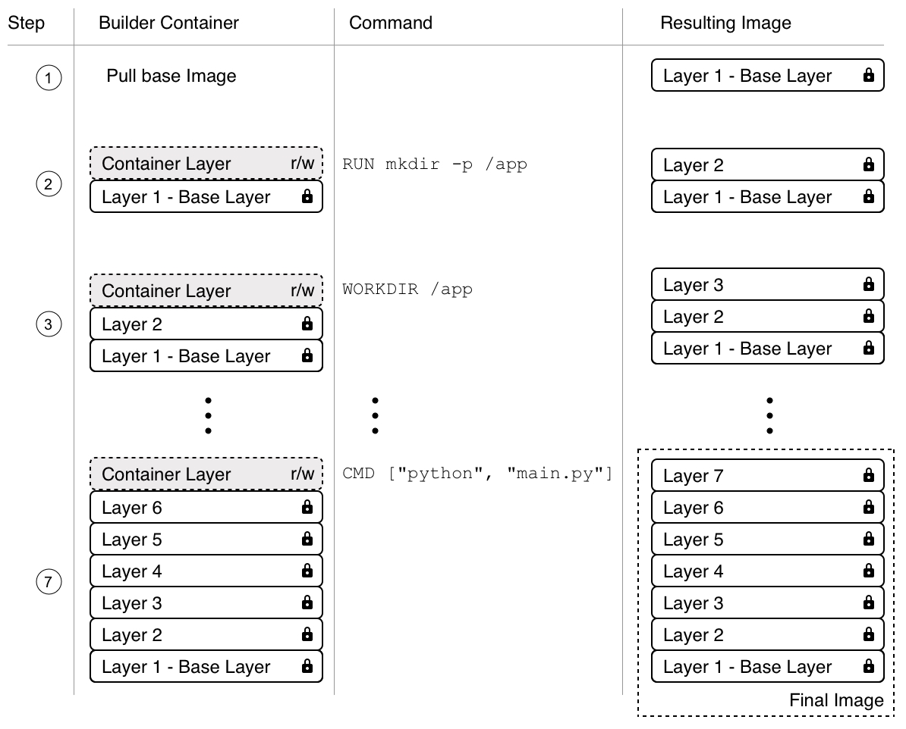

- [Mục Lục](#mục-lục)
- [Docker command](#docker-command)
  - [What is container](#what-is-container)
  - [What is image](#what-is-image)
  - [What is registry](#what-is-registry)
    - [Registry vs Repository](#registry-vs-repository)
- [Building Image](#building-image)
  - [Under standing the image layer](#under-standing-the-image-layer)
  - [Writting dockerfile](#writting-dockerfile)
  - [BUILD, TAG, AND PUBLISH an Image](#build-tag-and-publish-an-image)
    - [build image](#build-image)
    - [Tagging images](#tagging-images)
    - [Multi-stage builds](#multi-stage-builds)
  - [Running container](#running-container)
    - [publishing and exposing ports](#publishing-and-exposing-ports)
      - [Publishing to ephemeral ports](#publishing-to-ephemeral-ports)
      - [Publishing all port](#publishing-all-port)
    - [Overriding container default](#overriding-container-default)
      - [Setting environment variables](#setting-environment-variables)
      - [Restricting the container to consume the resources](#restricting-the-container-to-consume-the-resources)
    - [Persisting Container Data](#persisting-container-data)
      - [Container volumns](#container-volumns)
    - [Sharing local file with Containers](#sharing-local-file-with-containers)
- [Anotomy of container](#anotomy-of-container)
  - [Namespace](#namespace)
  - [cgroups](#cgroups)
  - [Union Filesystems (Unionfs)](#union-filesystems-unionfs)
- [Creating and managing container images](#creating-and-managing-container-images)
  - [The layered filesystem](#the-layered-filesystem)
  - [The writable container layer](#the-writable-container-layer)
  - [Copy on write](#copy-on-write)
  - [Interactive image creation](#interactive-image-creation)
  - [Building an Image](#building-an-image)
  - [Multi step build](#multi-step-build)
- [DOCKER FILE](#docker-file)
  - [FROM KEYWORD](#from-keyword)
  - [RUN KEYWORD](#run-keyword)
  - [COPY AND ADD KEYWORD](#copy-and-add-keyword)
  - [WORKDIR KEYWORD](#workdir-keyword)
  - [THE CMD and ENTRYPOINT](#the-cmd-and-entrypoint)
  - [DOCKER FILE MULTI-STAGE](#docker-file-multi-stage)
  - [Best practice Dockerfile](#best-practice-dockerfile)
  - [Saving and Loading Image](#saving-and-loading-image)
- [Lift and shift: Containerizing a legacy app](#lift-and-shift-containerizing-a-legacy-app)
  - [Analysis of external dependencies](#analysis-of-external-dependencies)
  - [Source code and build instructions](#source-code-and-build-instructions)
  - [Configuration](#configuration)
  - [Secrets](#secrets)
  - [Authoring the Dockerfile](#authoring-the-dockerfile)
- [Sharing and shippiing Images](#sharing-and-shippiing-images)
  - [Tagging an image](#tagging-an-image)
  - [Image namespaces](#image-namespaces)
  - [Pushing images to a registry](#pushing-images-to-a-registry)
- [Data Volumes and Configurations](#data-volumes-and-configurations)
  - [Defining volumes in images](#defining-volumes-in-images)
- [Configuration Container](#configuration-container)
  - [Defining environtment variables for containers](#defining-environtment-variables-for-containers)
  - [Define env variables in container images](#define-env-variables-in-container-images)
  - [Environment variables at build time.](#environment-variables-at-build-time)
- [Using docker to supercharge automation](#using-docker-to-supercharge-automation)
  - [Using Docker to power a CI/CD pipeline](#using-docker-to-power-a-cicd-pipeline)
- [Advanced Docker usage scenarios](#advanced-docker-usage-scenarios)
  - [Running Docker in Docker](#running-docker-in-docker)
  - [Formatting output of common docker command](#formatting-output-of-common-docker-command)
  - [Filter the output of common Docker commands](#filter-the-output-of-common-docker-commands)
  - [Limiting resources consumed by a container](#limiting-resources-consumed-by-a-container)
  - [Read-only file system](#read-only-file-system)
  - [Running your termianl in a remote container and accessing it via https](#running-your-termianl-in-a-remote-container-and-accessing-it-via-https)
- [Instrumenting your code to produce meaningful logging information](#instrumenting-your-code-to-produce-meaningful-logging-information)
- [Using docker to Supercharge Automation](#using-docker-to-supercharge-automation-1)
- [Distributed Application Architecture](#distributed-application-architecture)
  - [Defining the terminology](#defining-the-terminology)
  - [Pattern and best practice](#pattern-and-best-practice)
    - [Load balancing](#load-balancing)
    - [Circuit breaker pattern](#circuit-breaker-pattern)
  - [Application update](#application-update)
- [Single host networking](#single-host-networking)
  - [Dissecting the container network model](#dissecting-the-container-network-model)
  - [Network firewalling](#network-firewalling)
  - [Running in an existing network namespace](#running-in-an-existing-network-namespace)

# Mục Lục

# Docker command

```docker
-----------------------------------------------------------------------
** Run image **

`docker run -d -p 8080:80 docker/welcome-to-docker`
params:  -d is detached mode ->  run in background mode and return id of container when it runs instead of show output of container in terminal
         -p is port, 8080 is host in server, 80 is port of container use to listen


-----------------------------------------------------------------------
`docker ps (process status) -> list container is running`
`docker ps -a  -> all container`
`docker stop <container-id> -> stop container`
`docker image ls -> list downloaded image = docjer images`
`docker image history <repo>` -> This output shows you all of the layers, their sizes, and the command used to create the layer, each layer in dockerfile is one layer, can use --no-trunc to show all command


-----------------------------------------------------------------------
** Search Image **
`docker search .....`

-----------------------------------------------------------------------

** Pull image **
`docker pull .....`
-----------------------------------------------------------------------
** Build image **
`docker build -t YOUR_DOCKER_USERNAME/docker-quickstart . ` (ensure . at last command to find docker file)
can add tag label
`docker build -t YOUR_DOCKER_USERNAME/docker-quickstart:1.0 .`


----------------------------------------------------------------------
** Tag docker image **
`docker tag YOUR_DOCKER_USERNAME/docker-quickstart YOUR_DOCKER_USERNAME/docker-quickstart:1.0`
-----------------------------------------------------------------------
** PUSH to Docker Hub **
`docker push YOUR_DOCKER_USERNAME/docker-quickstart:1.0`


-----------------------------------------------------------------------
** Docker Compose **
`docker compose up -d --build`  -> buld docker , -d: detach mode, --build: rebuild container from image in file docker-compose.yml as when as it exists.

docker compose down -> remove everything

By default, volumes aren't automatically removed when you tear down a Compose stack. The idea is that you might want the data back if you start the stack again.

If you do want to remove the volumes, add the --volumes flag when running the docker compose down command:
docker compose down --volumes

-----------------------------------------------------------------------
** Run container **
`docker run --name=<container-name> -ti node-base`
- it: -t create a terminal pseudo (Pseudo-TTY) for container
      -i : interactive mode -> connect and interact with container when it start up,instead of stop immediately

-----------------------------------------------------------------------
** Check container logs **
`docker logs node-app-v1`

**Get 5 lasted log**
`docker container logs --tail 5 <container-name>`

** Get realtime logs **
`docker container logs --tail 5 --follow <container-name>`


** Advance change default log **

```

cd /etc/docker
touch daemon.json
{  
 "Log-driver": "json-log",  
 "log-opts": {  
 "max-size": "10m", file log max 10Mb
"max-file": 3 number of file max is 3
}
}

```
-----------------------------------------------------------------------
** Building image **
`docker build .`
- The final . in the command provides the path or URL to the build context. At this location, the builder will find the Dockerfile and other referenced files.

-----------------------------------------------------------------------
**To tag an image during a build, add the -t or --tag flag:**
`docker build -t my-username/my-image .`

-----------------------------------------------------------------------
**If you've already built an image, you can add another tag to the image by using the docker image tag command:**

`docker image tag my-username/my-image another-username/another-image:v1`

-----------------------------------------------------------------------
**Push docker to a registry:**
`docker push my-username/my-image`


-----------------------------------------------------------------------
**set environment for container**
`  docker run --env-file .env postgres env `
` docker run -e ENV_VARIABLE=ENV_VALUE postgres env  `


-----------------------------------------------------------------------
**Create custom network**
`docker network create NETWORK_NAME`

**verify network**
`docker network ls`

**check network**
`docker network inspect NETWORK_NAME`

pass --network in docker run to override default by connecting the container to custom docker network (default is bridge network)
`docker run -d -e POSTGRES_PASSWORD=secret -p 5434:5432 --network mynetwork postgres`

-----------------------------------------------------------------------
**Create a volume**
`docker volume create VOLUMN_NAME`

**List all volume:**
`docker volume ls`

**Remove volume (only work if not attach to container)**
`docker volume rm <name or id>`

**Remove all volume unused**
`docker volume prune`


-----------------------------------------------------------------------
**Sharing local file with container**
`docker run -v HOST_DIR:CONTAINER_DIR`

**Using bind mount:**
`docker run --mount type="bind",source=/HOST/PATH,target=/CONTAINER/PATH,<permisstion access>` image`


-----------------------------------------------------------------------
**Use attach command to attach out Terminal standard input, output, err to running container**

`docker attach <container-name/id>`  (to exit using Ctrl+P Ctrl+Q)


-----------------------------------------------------------------------


-----------------------------------------------------------------------


-----------------------------------------------------------------------


-----------------------------------------------------------------------


-----------------------------------------------------------------------


-----------------------------------------------------------------------


-----------------------------------------------------------------------


-----------------------------------------------------------------------


-----------------------------------------------------------------------


```

## What is container

Container is isolate processes for each of your app component. Each component - the frontend React app, the Python API engine, and the database - runs in its own isolated environment, completely isolated from everything else on your machine.

Self-contained. Each container has everything it needs to function with no reliance on any pre-installed dependencies on the host machine.
Isolated. Since containers are , run in isolation, they have minimal influence on the host and other containers, increasing the security of your applications.
Independent. Each container is independently managed. Deleting one container won't affect any others.
Portable. Containers can run anywhere! The container that runs on your development machine will work the same way in a data center or anywhere in the cloud!

## What is image

A container image is a standardized package that includes all of the files, binaries, libraries, and confinguration to run container
Two principle of image:

- Images are immutable. Once an image is created, it can't be modified. You can only make a new image or add changes on top of it.
- Container images are composed of layers. Each layer represents a set of file system changes that add, remove, or modify files.

## What is registry

An image registry is centralize location for storing and sharing your container image. It can be either public or private
Some contrainer registry: Amazon elastic Container registry(ECR), GitLab container registry etc.

### Registry vs Repository

- A registry is centralized location that stores and manages container image
- Repository is a collection of related container image within a registry
  

# Building Image

## Under standing the image layer

- Image Layers: each layer contains a set of file system changes- additions,deletions, or modifications.
  - The first layer adds basic commands and a package manager, such as apt
  - The second layer installs a python runtime and pip for dependency management
  - The third layer copies in an appication's specific requirements.txt file
  - The fourth layer installs that application's specific dependencies
  - The fifth layers copies in the actual source code of the application
- normally use dockerfile to create image layers, can create layner manually

```docker
  docker run --name=base-container -ti ubuntu
  // root@d8c5ca119fcd:/#
  apt update && apt install -y nodejs
  node -e 'console.log("Hello world!")'
  docker container commit -m "Add node" base-container node-base
  docker image history node-base
  docker run node-base node -e "console.log('Hello again')"
  docker rm -f base-container
  docker run --name=app-container -ti node-base
  echo 'console.log("Hello from an app")' > app.js
  node app.js
  docker container commit -c "CMD node app.js" -m "Add app" app-container sample-app
  docker image history sample-app
  docker run sample-app
  docker rm -f app-container
```

## Writting dockerfile

A dockerfile is a text base document that's used to create a container image.
Example:

```dockerfile
FROM python:3.12
WORKDIR /user/local/app

COPY requirements.txt ./
RUN pip install --no-cache-dir -r requirements.txt
COPY src ./src
EXPOSE 5000
RUN useradd app
USER app

CMD ['uvicorn' ,'app.main:app', '--host','0.0.0.0', '--port','8000']

```

- `FROM <image>` - this is specifies the base image that the build will extend.
- `WORKDIR <path>` - this instruction specifies the "working directory" or the path in the image where files will be copied and commands will be executed.
- `COPY <host-path> <image-path>` - this instruction tells the builder to copy files from the host and put them into the contain`er image.
- `RUN <command>` - this instruction tells the builder to run the specified command.
- `ENV <name> <value>` - this instruction sets an environment variable that a running container will use.
- `EXPOSE <port-number>` - this instruction sets configuration on the image that indicates a port the image would like to expose.
- `USER <user-or-uid>`- this instruction sets the default user for all subsequent instructions.
- `CMD ["<command>", "<arg1>"]` - this instruction sets the default command a container using this image will run.

Containerize new projects quickly with docker init

The docker init command will analyze your project and quickly create a Dockerfile, a compose.yaml, and a .dockerignore, helping you get up and going

## BUILD, TAG, AND PUBLISH an Image

- Building images - the process of building an image based on a Dockerfile
- Tagging images - the process of giving an image a name, which also determines where the image can be distributed
- Publishing images - the process to distribute or share the newly created image using a container registry

### build image

- `docker build .` `.` in the command provides the path or URL to the build context. At this location, the builder will find the Dockerfile and other referenced files.

### Tagging images

`[HOST[:PORT_NUMBER]/]PATH[:TAG]`

- `HOST`: The optional registry hostname where the image is located. If no host is specified, Docker's public registry at docker.io is used by default.
- `PORT_NUMBER`: The registry port number if a hostname is provided
- `PATH`: The path of the image, consisting of slash-separated components. For Docker Hub, the format follows [NAMESPACE/]REPOSITORY, where namespace is either a user's or organization's name. If no namespace is specified, library is used, which is the namespace for Docker Official Images.
- `TAG`: A custom, human-readable identifier that's typically used to identify different versions or variants of an image. If no tag is specified, latest is used by default.

### Multi-stage builds

```docker
  FROM eclipse-temurin:21.0.2_13-jdk-jammy AS builder
  WORKDIR /opt/app
  COPY .mvn/ .mvn
  COPY mvnw pom.xml ./
  RUN ./mvnw dependency:go-offline
  COPY ./src ./src
  RUN ./mvnw clean install

  FROM eclipse-temurin:21.0.2_13-jre-jammy AS final
  WORKDIR /opt/app
  EXPOSE 8080
  COPY --from=builder /opt/app/target/*.jar /opt/app/*.jar
  ENTRYPOINT ["java","-jar","/opt/app/*.jar"]
```

## Running container

### publishing and exposing ports

- Publishing a port provides the ability to break through a little bit of networking isolation by setting up a forwarding rule. As an example, you can indicate that requests on your host’s port 8080 should be forwarded to the container’s port 80. Publishing ports happens during container creation using the -p (or --publish) flag with docker run. The syntax is:

```docker
   docker run -d -p HOST_PORT:CONTAINER_PORT nginx
   - HOST_PORT: The port number on your host machine where you want to receive traffic
   - CONTAINER_PORT: The port number within the container that's listening for connections
```

#### Publishing to ephemeral ports

simply omit the `HOST_POST` configuration

```docker
  docker run -p 80 nginx
```

#### Publishing all port

When creating a container image, the EXPOSE instruction is used to indicate the packaged application will use the specified port. These ports aren't published by default.
With the -P or --publish-all flag, you can automatically publish all exposed ports to ephemeral ports. This is quite useful when you’re trying to avoid port conflicts in development or testing environments.

```docker
  docker run -P nginx
```

### Overriding container default

####Overriding the network ports
`docker run -d -p HOST_PORT:CONTAINER_PORT postgres`

#### Setting environment variables

```docker
  docker run -e foo=bar  postgres env
```

The .env file acts as a convenient way to set environment variables for your Docker containers without cluttering your command line with numerous -e flags. To use a .env file, you can pass --env-file option with the docker run command.

```docker
  docker run --env-file .env postgres env
```

#### Restricting the container to consume the resources

You can use the `--memory` and `--cpus` flags with the docker run command to restrict how much CPU and MEMORY a container can use.
For example, you can set a memory limit for the Python API container, preventing it from consuming excessive resources on your host. Here's the command:

```docker
  docker run -e POSTGRES_PASSWORD=secret --memory="512m" --cpus="0.5" postgres
```

Can use command `docker stats` to monitor the real-time resource usage of running container.

**KEY different between default bridge and custom networks**

1. DNS resolution: by default, containers connected to the default bridge network can communicate with each other, but only by IP address.

### Persisting Container Data

#### Container volumns

To create volume -> docker volume create <volume_name>
docker volume rm <volume>

### Sharing local file with Containers

- Docker offer two primary storage options for persisting data and sharing files between the host machine and containers
- if want to ensure that data generated or modified inside the container persists even after the container stop, you would opt for a volume
- If you have specific files or directories on your host system that you want to directly share with your container, like configuration files or development code, then you would use a bind mount.

if you use `-v` or `--volume`, if the host directory isn't exist, a directory will be automatically created.
if you use `--mount` to bind mount a file or directory that doesn't yet exist on the Docker host, the docker run command doesn't automatically create it for you but generates an error.

# Anotomy of container

## Namespace

- Namespaces in Linux serve to isolate system resources so that each process or group of processes “sees” and “uses” resources as if they had a separate environment.

## cgroups

- Linux cgroups are used to limit, manage, and isolate resource usage of collections of processes running on system

## Union Filesystems (Unionfs)

- mainly used of Linux
- allow file and directory of distinct filesystems to be overlaid to form a single coherent filesystem (the individual filesystems are called branch)
- Contents of directories that have the same path within the merged branch will be seen in a single merged directory, within the new vitual filesystem
- When merging branches, the priority between the branches is specified. In that way, when two branches contain the same file, the one with the higher priority is seen in the final filesystem.

# Creating and managing container images

## The layered filesystem

- Container image are templates from which containers are created.
- images are composed of many layer. The first layer is base layer.
- Each individual layer contains files and folders. Each layer only contains the changes to the filesystem with respect to the underlying layers. (Docker use union filesystem)
- The layers of image are all immutable (means that once generated, it can't not be change). The only possible operation affecting the layer is its physical deletion
- The content of each layer is mapped to a special folder on the host, is usually a subfolder of /var/lib/docker/

## The writable container layer

When docker create a container from container image, it add a writable container layer on tob of this stack of immutable layers.

## Copy on write

- if a layer uses a file or folder that is avaiable in one of the low-lying layers, then it just uses it. A layer wants to modify, a file from a low-lying layer than it first copies this file up to the target layer and then modifies it.

## Interactive image creation

## Building an Image

Image process build visualize


## Multi step build

# DOCKER FILE

## FROM KEYWORD

- Define which base image we want to start building our custom image from.

## RUN KEYWORD

- The argument for RUN is any valid Linux command, such as the following

## COPY AND ADD KEYWORD

- two keywords are used to copy files and folders from the host into the image that we're building
- the two keywords are very similar, with the exception that the ADD keyword also lets us copy and unpack TAR files, as well as providing a URL as source for the files and folders to copy

```dockerfile
COPY . /app
COPY ./web /app/web
COPY sample.txt /data/my-sample.txt
ADD sample.tar /app/bin/
ADD http://example.com/sample.txt /data/
COPY ./sample* /mydir/    (can use wildcard in source path)
ADD --chown=11:22 ./data/web* /app/data/
```

- By default, all files and folders inside the image will have a user ID (UUID) and a group ID (GID) of 0, we can change the ownership using --chown

## WORKDIR KEYWORD

- The WORKDIR keyword defines the working directory or context that is used when a container is run from our custom image.
- Example `WORKDIR /app/bin`
- All activity that happend inside the image after the preceding line will use this directory as the working directory.
  =>>

```dockerfile
RUN cd /app/bin
RUN touch sample.txt

is different with

WORKDIR /app/bin
RUN touch sample.txt
```

## THE CMD and ENTRYPOINT

- While other keywords defined for a dockerfile are execute at the time the image is built, these two keyword are actually definations of what will happend when a container is started from image we define.
- ENTRYPOINT is used to defind command of the expession, while CMD is used to define the parameters for the command.

```dockerfile
FROM alpine:3.10
ENTRYPOINT ["ping"]
CMD ["-c" , "3", "3.8.8.8."]
=>> exec form
```

Alternative , can also use shell form

```dockerfile
CMD command param1 param2
```

- we can instead enter whole expression as a value of CMD and it will work, as shown in the following code block

```dockerfile
FROM alpine:3.10
CMD wget -O - http://www.google.com
```

- If ENTRYPOINT is missing, the default value is `/bin/sh -c`

## DOCKER FILE MULTI-STAGE

Example: ONE Stage

```dockerfile
FROM alpine:3.10 as build
RUN apk update && apk add --update alpine-sdk
RUN mkdir /app
WORKDIR /app
COPY . /app
RUN mkdir bin
RUN gcc -Wall hello.c -o bin/hello
CMD /app/bin/hello
```

-> container size is 188MB

```dockerfile
FROM alpine:3.10 as build
RUN apk update && apk add --update alpine-sdk
RUN mkdir /app
WORKDIR /app
COPY . /app
RUN mkdir bin
RUN gcc -Wall hello.c -o bin/hello

FROM alpine:3.10 as production
COPY --from=build /app/bin/hello /app/hello
CMD /app/hello
```

-> container size is 5.6MB

## Best practice Dockerfile

- Try hard to keep the time that is needed to initialize the application running inside the container at a minimum, as well as the time needed to terminate or clean up the application.
- Keep build times at a minimum. =>> should order the individual commands in the dockerfile so that we leverage caching as much as possible
- keep number layer is minimun, easiest way to reduce the number of layers is to combine multiple individual RUN command into single one.
  Example:

```dockerfile
RUN apt-get update
RUN apt-get install -y ca-certificates
RUN rm -rf /var/lib/apt/lists/*
=>>>
RUN apt-get update \
    && apt-get install -y ca-certificates \
        && rm -rf /var/lib/apt/lists/*
```

- use .dockerignore to avoid copying unnecessary files and folders into an image, to keep lean as posible.

## Saving and Loading Image

- Third way to create a new container image is by importing or loading it from a file.

```shell
docker image save -o ./backup/my-alpine.tar my-alpine
docker image load -i ./backup/my-alpine.tar
```

# Lift and shift: Containerizing a legacy app

## Analysis of external dependencies

- Does it use database? which one? what does connection string look like?
- Does it use external api? What are the API keys and key secrets?
- Is it consuming from or publishing to an Enterprise Service Bus (ESB)?

## Source code and build instructions

- Next step is to locate all source code and other assets, such as image and CSS and HTML files that are part of the application. Ideally, they should be located in single folder.
- An option to download or copy files during the build from different locations, using `COPY` and `ADD` commands. This option is useful if the sources for your legacy application cannot be easily contained in a single, local folder.

## Configuration

- We can differentiate a few types of configurations as follow:
  - `Build time`: This is the information needed during the build of the application and/or its Docker image. It needs to be available when we create the Docker images.
  - `Environment`: configuration information that varies with the environment in which the application is running, for example, DEVELOPMENT versus STAGING or PRODUCTION
  - `Runtime`: This is infomation that the application retrieves during runtime, such as secrets to access an external API.

## Secrets

- There are various ways traditional applications got their secrets. The worst and most insecure way of providing secrets is by hardcoding them or reading them from configuration files or environment variables, where they are available in cleartext.
- A much better way is to read the secrets during runtime from a special secrets store that persists the secrets encrypted and provides them to the application over a secure connection, such as Transport Layer Security (TLS).

## Authoring the Dockerfile

# Sharing and shippiing Images

## Tagging an image

- A tag is often used to version images, but it has a broader reach than just being a version number. If we do not explicitly specify a tag when working with images, then Docker automatically assumes we're referring to the latest tag.

## Image namespaces

- The most generic way to define an image an image is by its fully qualified name, which looks as follow:
  - `<registry URL><User or Org>/<name>:<tag>`
    - <register URL>: This is the URL, to the registry from which we want to pull the image. By default, this is docker.io, Other than docker hub, there are quite a few public registries out there that you could pull image from (google, Amazon, ...)
  - `<User or Org>`: This is the private Docker ID of either an individual or an organization defined on Docker hub, or any other registry, for that matter- such as microsoft or oracle.
  - `<name>`: this is the name of the image, which is often also, called a repository.
  - `<tag>`: This is the tag of image
  - Example: https://registry.acme.com/engineering/web-app:1.0
    - If we omit the registry URL, then Docker Hub is automatically taken.
    - If we omit the tag, then latest is taken.
    - If it is an official image on Docker Hub, then no user or organization namespace is needed.

## Pushing images to a registry

```bash
docker image tag alpine:lastest <user>/alpine:1.0
docker login -u <user> -p <password>
docker image push <user>/alpine:1.0

```

- with private repository -> can be pull if login and have permission

# Data Volumes and Configurations

## Defining volumes in images

```dockerfile
VOLUME /app/data
VOLUME /app/data, /app/profiles, /app/config
VOLUME ["/app/data", "/app/profiles", "/app/config"]
```

- path in docker file above is path in container
- when build image => docker automatically create volumes and mount it to the corresponding target folder of the container for each path defined in the docker file.Since each volume is created automatically by Docker, it will have an SHA-256 as its ID.

# Configuration Container

## Defining environtment variables for containers

- use `--env` or `-e` <key> = <value>
- `--env-file` in run command to pass collection of env

## Define env variables in container images

- to define default env for each container from image, we can define env for image with `ENV` keyword in dockerfile
- we can override env of image when running container from it.

## Environment variables at build time.

- we using `ARG` keyword to define default that is used each time we build an image from the preceding Dockerfile.
  Example

```dockerfile
ARG BASE_IMAGE_VERSION=12.7-stretch
FROM node:${BASE_IMAGE_VERSION}
WORKDIR /app
COPY packages.json .
RUN npm install
COPY . .
CMD npm start
```

- or we can use `--build-arg` <key>=<value>
  Example

```bash
$ docker image build --build-arg BASE_IMAGE_VERSION=12.7-alpine -t my-node-app-test .
```

# Using docker to supercharge automation

## Using Docker to power a CI/CD pipeline

# Advanced Docker usage scenarios

## Running Docker in Docker

- add docker cli in container, and use socket of docker deamon in host map to container to borrow docker engine from host to run docker.
  Example

```bash
#!/bin/bash
docker container run --rm --name builder \
-v /var/run/docker.sock:/var/run/docker.sock \
-v "$PWD":/usr/src/app \
-e HUB_USER=wind1102 \
-e HUB_PW=22102002hhbg \
-e REPO=sample-app \
-e TAG=1.0 \
builder

```

## Formatting output of common docker command

```bash
docker container ps -a --format "table {{.Names}}\t{{.Image}}\t{{.Status}}"
```

## Filter the output of common Docker commands

- `--filter <key>=<value>`

## Limiting resources consumed by a container

- we can limit the resource a single container can consume at.

```bash
$ docker container run --rm -it \
 --name stress-test \
 --memory 512M \
 ubuntu:19.04 /bin/bash
```

## Read-only file system

- the flag `--read-only` mounts the container's filesystem as read-only.

## Running your termianl in a remote container and accessing it via https

# Instrumenting your code to produce meaningful logging information

- `TRACE` : Very fine-grained information. At this level, you are looking at capturing every detail possible about your application's behavior.
- `DEBUG`: Relatively granular and mostly diagnostic information helping to pin down potential problems if they occur.
- `INFO`: Normal application behavior or milestones.
- `WARN`: The application might have encountered a problem or you detected an unusual situation.
- `ERROR`: The application encountered a serious issue. This most probably represents the failure of an important application task.
- `FATAL`: The catastrophic failure of your application. The immediate shutdown of the application is advised.

# Using docker to Supercharge Automation

# Distributed Application Architecture

## Defining the terminology

- `VM`: The acronym for virtual machine. this is virtual compute.
- `Node`: An individual server used to run application, this can be a phisical server, often called bare-metal, or a VM. Normally, a node is part of a cluster
- `Cluster`: A group of nodes connected by a network that used to run distributed applications
- `Network`: Physical and software defined communication paths between individual nodes of a cluster and programs running on those nodes.
- `Port`: A channel on which an application such as a web server listens for incoming requests.
- `Service`: is a very overloaded term and its real meaning depends on the context that it is used in.

## Pattern and best practice

### Load balancing

- is external service that intercepts the call and takes over the part of deciding which of the target service instances to forward the call to.
- Use different algo to decide how to distribute incomming call to target service.
- Most common algo is round-robin.

### Circuit breaker pattern

- is mechanism that is used to avoid a distributed system application going down due to the cascading failure of many essential component.
- Once the number of failures reaches a certain threshold, the circuit breaker trips. All subsequent calls to the circuit breaker will return with an error, without the protected call being made at all

## Application update

- `Rolling update`: The assumption here is that the particular piece of software that has to be updated runs in multiple instances. Only then can we use this type of update. the next instance of the current service is taken down and replaced with a new instance. This pattern is repeated until all the service instances have been replaced.
- `Blue green deployment`: current version is blue, new version of application is green. The new service is not wired with the rest of the application yet. Once green is installed, we can execute smoke tests against this new service and, if those succeed, the router can be configured to funnel all traffic that previously went to blue to the new service, green.
- `Canary release`: current version and new version install parallel. Config a router so that it funnels a small percentage, 1%. If oke => funnel more traffic, say 5%....-> repeated until 100%.

# Single host networking

## Dissecting the container network model

- Container network model (CNM):

  - `Sandbox`: The sandbox perectly isolates a container from the outside world. No inbound connection directly allowed into the sandboxed container.
  - `Endpoint`: An endpoint is a controlled gateway from the outside world into the network's sandbox that shields the container. The endpoint connects the network sandbox (but not the container) to the third element of the model, which is the network.
  - `Network`: The network is the pathway that transports the data packets of an instance of communication from endpoint to endpoint or, ultimately, from container to container.
    

- we have multiple implementations of CNM:

| **Network**               | **Company** | **Scope** | **Description**                                                                          | **Typical Use Case**                                   |
| ------------------------- | ----------- | --------- | ---------------------------------------------------------------------------------------- | ------------------------------------------------------ |
| **Bridge**                | Docker      | Local     | Simple network based on Linux bridges to allow networking on a single host               | Default network for containers on a single host        |
| **Macvlan**               | Docker      | Local     | Configures multiple layer 2 (that is, MAC) addresses on a single physical host interface | When containers need direct LAN access with unique IPs |
| **Overlay**               | Docker      | Global    | Multinode-capable container network based on Virtual Extensible LAN (VXLAN)              | Connecting containers across multiple Docker hosts     |
| **Weave Net**             | Weaveworks  | Global    | Simple, resilient, multi-host Docker networking                                          | Simplifying networking in multi-node environments      |
| **Contiv Network Plugin** | Cisco       | Global    | Open source container networking                                                         | Enterprise-grade networking and policy management      |

## Network firewalling

## Running in an existing network namespace
