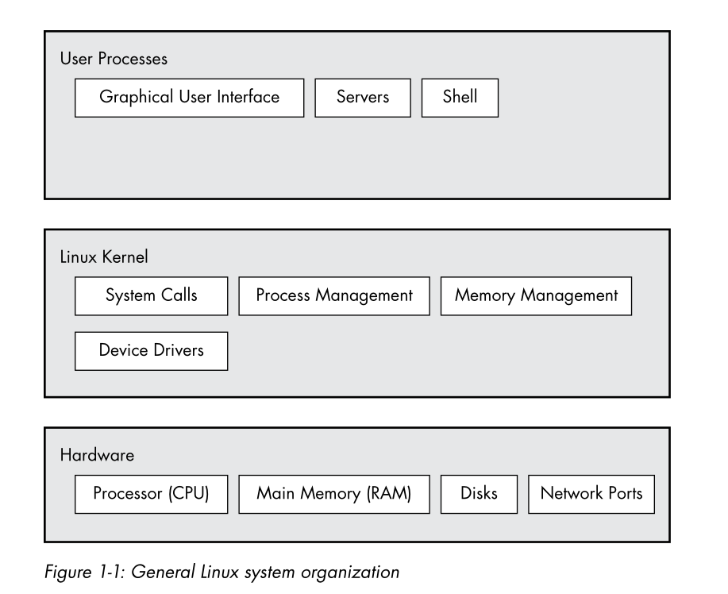
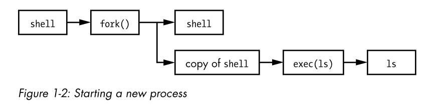

- [Level and Layer of abstraction in a linux system](#level-and-layer-of-abstraction-in-a-linux-system)
- [Hardware: Understanding Main Memory](#hardware-understanding-main-memory)
- [The Kernel](#the-kernel)
  - [Process management](#process-management)
  - [Memory management](#memory-management)
  - [System call and support](#system-call-and-support)
- [User Space](#user-space)
- [User](#user)

# Level and Layer of abstraction in a linux system

- A Layer and Lever is a classification (or group-ping) of a component according to where that component sits between the user and the hardware.
- A Linux-system has three main levels.
  - Hardware is the base, includes RAM, CPUs, Disk, Network port
  - Next level is kernel -> core of OS. The kernal is software in memory that tell CPU what to do. The kernel manages the hardware and act primaryly as an interface between hardware and any running program.
- Process - the running programs that the kernal manages-collectively makeup system's upper level, called (A more specific term for
  process is user process)

# Hardware: Understanding Main Memory
- A main memory just big storage area for a bunch of 0s and 1s.
- A state is a particular arrangment of bits

# The Kernel
- Nearly everything the kernel does revolves around main memory.
- The kernel is charge of managing task in four general system area:
  - Process: The kernel is responsible for determining which process are allowed to use the CPU
  - Memory: The kernel keep track of all memory- what is currently allocated to particular process. 
  - Driver device: The kernel acts as an interface between hardware and processes.
  - System call and support: Process normally use system calls to communicate with the kernel. 
## Process management
- Process management describe the starting, pausing, resuming and terminating of process.
- One process uses the CPU for another small fraction of a second, then another process takes a turn, and so on. 
  - The act of one process giving up control of the CPU to another process is called a **context switch**
  - Each piece of time - called a **time slice**. Slice is small, human can perceive the, and system appear to be running multiple processes at the time (a capacity know as **Multitasking**)
- Kernel is responsible for context switching
- Example of process is running in user mode but its time slice is up
  - The CPU (actual hardware) interrupt current process based on an internal timer, switches into kernel mode. and hands control back to kernel
  - The Kernel records the current state of CPU and memory (need to resuming process)
  - The Kernal performs any task that might have come up during preceding time slice.
  - The kernel is now ready to let another process run. The kernel analyzes the list of processes that are ready to run and chooses one.
  - The kernel prepares the memory for this new process, and then prepares the CPU.
  - The kernel tells the CPU how long the time slice for the new process will last.
  - The kernel switches the CPU into user mode and hands control of the CPU to the process.

## Memory management
- The kernel must have its own private area memory that user can access
- One user process may not access the private memory of another process
- Each user process needs its own section of memory.
- User processes can share memory.
- Some memory in user processes can be read-only.
- The system can use more memory than is physically present by using disk space as auxiliary.

## System call and support 
- a system call is an interaction between a process and the kernel.
  - fork() -> When a process calls fork(), the kernel creates a nearly identical copy of the process.
  - exec() -> When a process calls exec(program), the kernel starts program, replacing the current process.

# User Space
- the main memory that the kernel allocates for user processes is called user space.
- Because a process is simply a state (or image) in memory, user space also refers to the memory for the entire collection of running processes.
# User
- User is an entity that can run processs and own files.
- User associate with username
- Kernel doesn't manage username; instead, it identifies user by simple numeric identifies call userids.
- Groups are set of users. The primary purpose of groups is to allow a user to share file access to other users in a group.