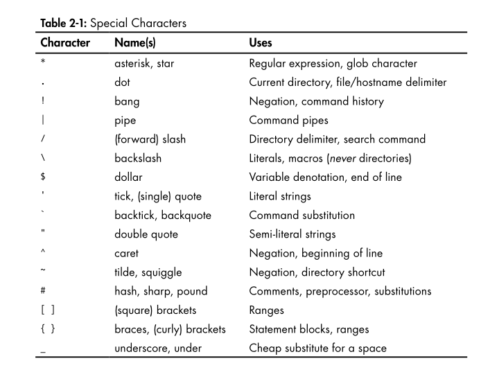
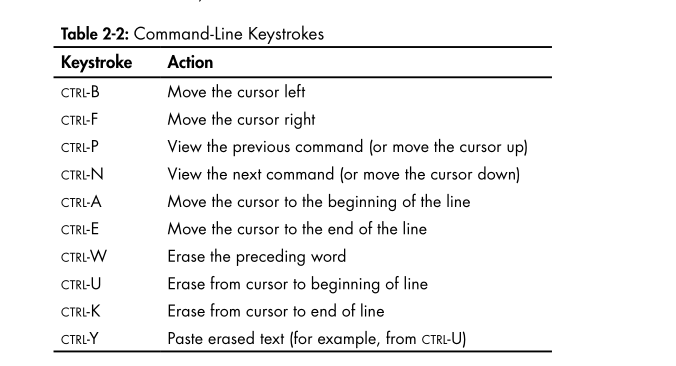
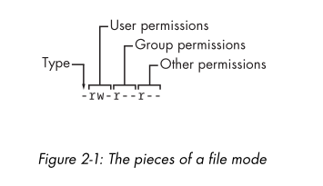
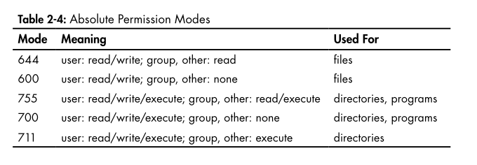
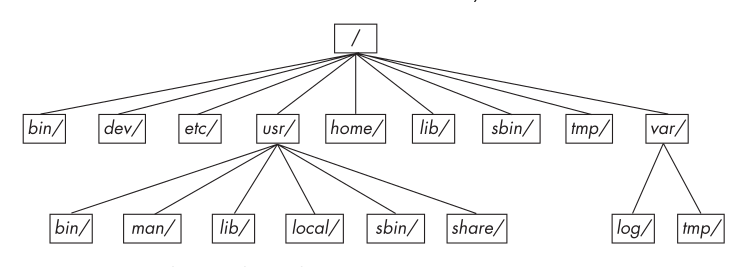

- [Level and Layer of abstraction in a linux system](#level-and-layer-of-abstraction-in-a-linux-system)

# Bourne shell: /bin/sh

- Can change the shell using cmd `chsh`

# Using the shell

## The shell window

```shell
echo "Hello"
```

## cat

- it simply output the content of one or more files
- syntax
  ```shell
    cat file1 file2
  ```

## Standard output and input

- Unix process use I/O streams to read and write data
- Streams are very flexible, the source of input stream can be a file, a device, a terminal or even output stream from another process
- Standard output and Standard input abbriviate as stdin and stdout. Many commands operate as cat does.If you don't specific an input file, the command reads from stdin.
- There is a third standard I/O stream called standard error.

# Basic command

## ls

- The ls command lists the content of a directory, default is current directory.
- `ls -l` for detailed (long) listing
- `ls -F` to display file infomation

## cp

- to copy file1 to file2 `cp file1 file2`
- To copy a number of file to a directory(folder) name dir `cp file1...fileN dir`

## mv

- move command is like cp, in it simplest form, it rename a file `mv file1 file2`
- can use `mv` to move number of files to a directory `mv file1 file2 dir`

## touch

- touch command create a file, if file exist, touch doesn't change it, but it update the file's modification time stamp printed with the `ls -l` command

```shell
touch file
```

## rm

- to delete a file `rm file`, after remove a file, it's gone from your system and generally cannot be undeleted
- `rm -r dir` to remove directory

## echo

- print its arguments to the standard output

```shell
echo Hello again.
-> Hello again.
```

# Navigating Directores

- Unix has a directory hierarchy that starts at `/` as root dir
- a path beginning with `/` is absolute path
- a path not beginning with `/` is relative path
- `..` refer to parent dir
- `.` refer to current dir

## cd

- current working directory is dir that a process is currently in.
- `cd` command change current dir `cd dir`
- if omit dir, the shell return your `home directory`, the directory started when you first logged in.

## mkdir

- create a directory `mkdir dir`

## rmdir

- remove directory `rmdir dir`.
- if dir isn't empty, the command is fail. Can use `rm -rf dir` to delete directory and it content

## Shell globbing (Wildcards)

- The shekk can match simple patterns to the file and dir name, a process known as globbing.
- `echo *` print list of dir and file in current directory
- at\* expands to all filenames that start with at.
- \*at expands to all filenames that end with at.
- _at_ expands to all filenames that contain at.
- If no files match a glob, the shell performs no expansion, and the command runs with literal characters such as \*
- another shell glob character, the question mark (?), instructs the shell to match exacty one arbitrary character.Example `b?at` matches boat and brat
- if don't want the shell to expand a glob in a command, enclose the glob in single quotes (''). `echo '*' -> *`

# Intermediate Commands

## grep

- the `grep` command prints the lines from a file or input stream that match expression.
- Example: `grep root /etc/passwd` or `grep root /etc/*`
- two most important `grep` options is
  - `-i` for case-insensitive match
  - `-v` for invert search -> print all line that don't match
- grep understands pattern known as regex
- two important thing about regex:
  - `.\*' match any number of character
  - `.` match one arbitary character

## less

- with a big file, using `less` to see a contents of the file one screenfull at a time.
- using `space` to go forward and `b` key to skip back one fullscreen at a time. press `q` to quit.
- can search inside `less`

  - `/word` to search forward
  - `?word` to search backward
  - press `n` for continue searching, N for previous

- You can send the standard output of nearly any program directly to another program standard input
- Example `grep ie /usr/share/dict/words | less`

## pwd

- The pwd (print working directory) program simply outputs the name of the current working directory
- if using symbolic link -> using pwd -P to show original path

```shell
ln -s /home/user/projects /tmp/myproj
cd /tmp/myproj
pwd
# /tmp/myproj

pwd -P
# /home/user/projects
```
## diff
- see different between two text file
- `diff file1 file2`

## file
- If you see a file and are unsure of its format, try using the file command to see if the system can guess: 
- `file file`

## find and locate
- It’s frustrating when you know that a certain file is in a directory tree some-where but you just don’t know where. Run find to find file in dir:
- `find <dir> -name <file> -print`
- `-print` means show full path of each matching file

## head and tail
- to quickly view a portion of a file or stream data.
- `head` show the begin of file
- `tail` show the last of file
- `-n` options is the number of line you want to see
- `tail +n` to print line starting at line n.

## sort
- the sort command quickly puts the lines of a text file in alphanumeric order
- If the file’s lines start with numbers and you want to sort in numeri-cal order, use the -n option. 
- The -r option reverses the order of the sort.


# Changing your passwd and shell
- using `passwd` to change your password
- using `chsh` to change the shell to another shell

# Dot file
- the file beginning with a dot (.)
- the directory beginning with a dot (.) -> dot directory
- shell glob don't match dot file unless you using pattern .*

# Environtment and Shell variable
- The shell can store temporary variable called `shell variables`, containing value of text strings.
- to assign value to shell variable, using the sign equal (=)
```shell
STUFF=haha
echo $STUFF  #haha
```
- environtment variable is like a shell variable, but not specific to a shell
- All processes on Unix systems have environment variable storage.
- The different of shell var and env var is
  - The shell pass all shell var to program that shell run, whereas shell variable can not be accessed in the command that you run
- Assign env variable using the shell `export` command
```shell
STUFF=haha
export STUFF
```


# The Command Path
- PATH is special env variable that contains the `command path`
- A command path is a list of system directories that the shell
searches when trying to locate a command.
- For example, when you run ls, the shell searches the directories listed in PATH for the ls program. If programs with the same name appear in several directories in the path, the shell runs the first matching program.
- if want to search more place for program, example in <dir>, using
  - `PATH=dir:$PATH`
  - `PATH=$PATH:dir`

# Special Characters

<p align="center">

</p>

# Command line editing
<p align="center">

</p>

# Getting Online Help
- `man ls`
- `man -k keyword`
- `info command`

# Shell Input and Output
- To send output of command to a file instead of the terminal, use the redirection character
- `command > file`
- The shell creates file if it does not exist. if existm the shell earses (clobber) the original file .Using `set -C` to avoid clobbering in bash. 
- uing `>>` to append the output instead overriting it 
- `command >> file`

- To send the standard output of a command to the standard input of
another command, use the pipe character (|)

## Standard Error
- Occasionally, you may redirect standard output but find that the pro-
gram still prints something to the terminal. This is called standard error (stderr); it’s an additional output stream for diagnostics and debugging. For example, this command produces an error:
```shell
ls /fffffffff > f
```
- to send standard output to f and standard error to e use `2>` syntax

```shell
ls /fffffffff > f 2> e
```

- The number `2` is streamId that shell modifies. Stream ID 1 is standard output, and 2 is standard error 
- You can also send the standard error to the same place as stdout with
the `>&` notation. For example, to send both standard output and standard error to the file named f, try this command
```shell
ls /fffffffff > f 2>&1

```

## Standard Input Redirection
- to channel a file to a program's standard input, use the `<` operator
- `command < /proc/cpuinfo` 
```shell
head < /proc/cpuinfo

```

# Listing and Manipulating Process
- `ps`
  - PID The process ID
  - TTY: terminal device process is running
  - STAT: process status
  - TIME: amount of CPU time that process has used so far
  - COMMAND: This one might seem obvious, but be aware that a process can change this field from its original value
- option
  - `x` show all running process
  - `ax` Show all processes on the system, not just the ones you own.
  - `u` Include more detailed information on processes.
  - `w` Show full command names, not just what fits on one line

## Killing Processes
- To terminate a process, send it a signal with the kill command
  - `kill pid`
- there are many type of signals, default is TERM (terminate)
- to freeze a process using STOP 
  - `kill STOP pid`
- Use the CONT signal to continue running the process again:
  - `kill -CONT pid`
- Using CTRL-C to terminate process, is the same as `kill INT`

## Job control
- using amperand `&` to detach process from the shell and put it in the "background"

# File Modes and Permissions
- Each file has set of permission that determine you can read, write, or run the file
<p align="center">

</p>

```shell
ls -l

#ouput 
-rw-r--r-- 1 juser somegroup 7041 Mar 26 19:34 endnotes.html

```
- `-rw-r--r--`
  - The first character is file type 
  - next 3 character `rw-` is permission for user
  - next 3 character `r--` is permission for group
  - final `r--` is permission for other
- each permission set can contain four basic representations:
  - `r` - readable
  - `w` - writable
  - `x` - executable
  - `-` - Means nothing
- use `groups` to see what group you are in

## Modifying permissions
- to change the permission using comand `chmod`. 
  - first, pick the set of permission that you want to change
  - then pick the bit to change
  - `+` is add permission, `-` is remove permission
    - `chmod g+r file`
    - `chmod ugo+r file`
- Permission mode (represent permission bits in octal form)
  - `111` -> 1*2^2 + 1*2^1 + 1*2^0 (present bit)
  - `r` = 4 = `100`
  - `w` = 2 = `010`
  - `x` = 1 = `001`

- Directory also have permissions. You can list the contents of a directory if it's readable. But you can access the file in a directory if the dir is executable.


<p align="center">

</p>

## Creating symbolic links
- 
  - `ln -s target linkname`
    - `-s` flag specifies a symbolic link
    - `ln` verbose is linkname

# Archiving and Compressing File
## gzip 
- `gzip <file>`
- `gunzip <file>.gz`

## tar
- `tar cvf archive.tar file1 file2` 
  - `c` create mode
  - `v` active verbose
  - `f` file options 
- unpacking `tar xvf archive.tar`
    - `x` execute

## Compressed Archives (.tar.gz)
- = tar + gzip
- `zcat file.tar.gz | tar xvf -f` to pipe unpack file tar.gz
- `tar ztvf file.tar.gz` to verify a compressed archive
  - `t` mode stands for "list" — it tells tar to display the contents of an archive without extracting anything.

# Linux directory hierarchi essentials


<p align="center">

</p>


- `/bin` Contains ready-to-run programs
- `/dev` Contains device file
- `/etc` Core system configuration dir, contains the user password, boot, device, networking, and other group file.
- `/home` Holds personal directories for regular users
- `/lib` holds library files contaning code that executables can use
- `/proc` Provides system statistics through a browsable directory-and-file interface. The /proc directory contains information about currently running processes as well as some kernel parameters.
- `sys` like `/proc`, provides a device and system interface
- `sbin` The place for system executables
- `/tmp` storage area for smaller,temporary files
- `/usr` not contains user files. Instead it contains a large directory hierarchy, include bulk of the Linux system
- `/var` the variable subdirectory, where programs record runtime infomaion. System logging, user tracking, caches, and other file system program create and manage are here

## Other root subdir 

- `/boot` contain kernel boot loader files
- `/media` A base attachment point for removeable media such as flash drives that is found in many distributions
- `/opt` contains addtional third-party software

## The /usr dir
- `/usr/bin`
- `/usr/lib`
- `/include` holds header files used by the C compiler
- `/info` contains GNU info manuals 
- `/local` Is where admin can install their own software
- `/man` contain manual page
- `/share` Contains files that should work on other kinds of Unix machines with no loss of functionality.

# Running command as super users

# sudo 
- `sudo .....`
# /etc/sudoer
- System does'nt let just any user run commands as the super-user -> must configure the privileged users in your /etc/sudoer file.

```shell
User_Alias ADMINS = user1, user2
ADMINS ALL = NOPASSWD : ALL

root ALL =(ALL) ALL
```

- `ALL` first is any host 
- extra (ALL) mean super user can run command as any user
- `ALL` last is any command


