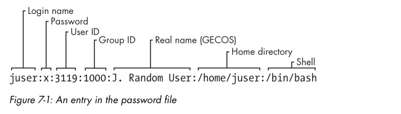
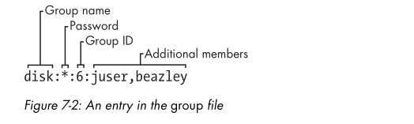
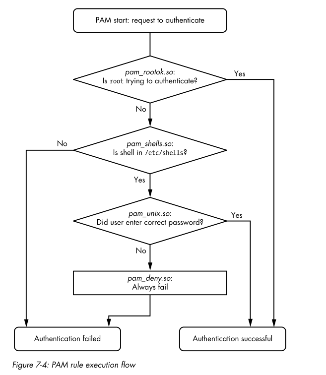

# User Management Files
## The /etc/password file

<p align="center">

</p>

## /etc/shadow file 
- contain encrypt password

## working with group ( /etc/group)

<p align="center">

</p>

- To see group you belong to, use `groups`


# Scheduling Recurring Task with cron
## Installing crontab Files
- use `crontab <file>` to intall *file* as your current crontab.
- `crontab -l` list crontab
- `crontab -r` remove crontab
- `crontab -e` to edit and intall your crontab in one step.

## System Crontab file

- to run a job one in the future without using cron, using `at` command
```shell
at <time>
at> myjob
```
- end the input with ctrl-D
- to check a job has been scheduled, use `atq`.


# PAM (Pluggable Authentiction Modules)
## PAM configuration

- example find for chsh: `auth       requisite   pam_shells.so`
  - Function type: this funtion that a user application ask PAMs to perform, example `auth`
  - Control argument: this setting controls what PAM does after success or failure of it action for the current line. example `requisite`
  - Module:     The authentication module that runs for this line, example: `pam_shells.so`

## Funtion types
- `auth` authenticate a user
- `account` Check user account status
- `session` Perform something only for the user's current session
- `password` Change a user's password or other credentials.

## Control Arguments and Stacked Rules

- `sufficient` If this rule succeed,  the authentication is successfull, and PAM does not need to look at any more rules. If the rule fails, PAM proceeds to additional rules.
- `requisite` If this rule succeeds, PAM proceeds to additional rules. If the rule fails, the authentication is unsuccessful, and PAM does not need to look at any more rules.
- `required` If this rule succeeds, PAM proceeds to additional rules. If the rule fails, PAM proceeds to additional rules but will always return an unsuccessful authentication regardless of the end result of the additional rules.

Stack rule Example:
```shell
auth sufficient pam_rootok.so
auth requisite pam_shells.so
auth sufficient pam_unix.so
auth required pam_deny.so
```

<p align="center">

</p>