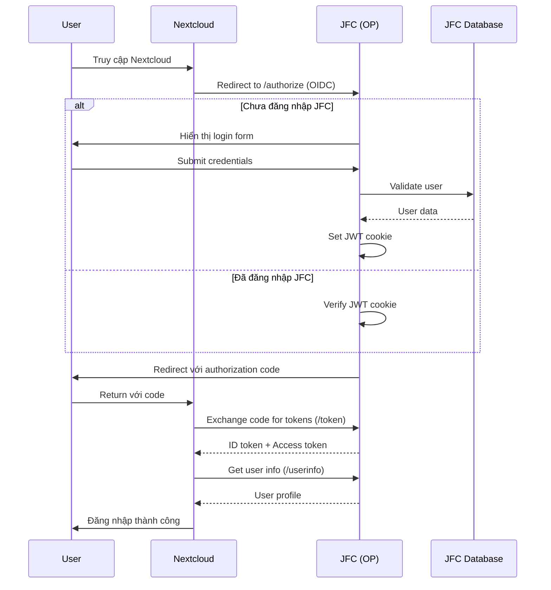
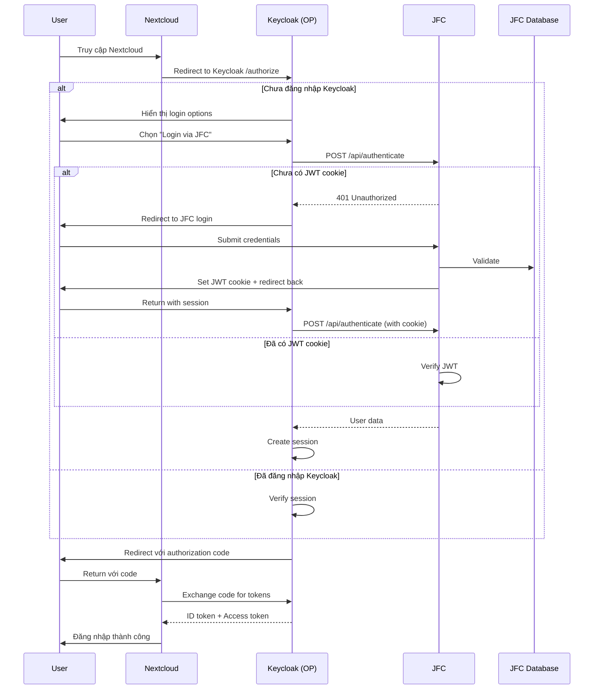
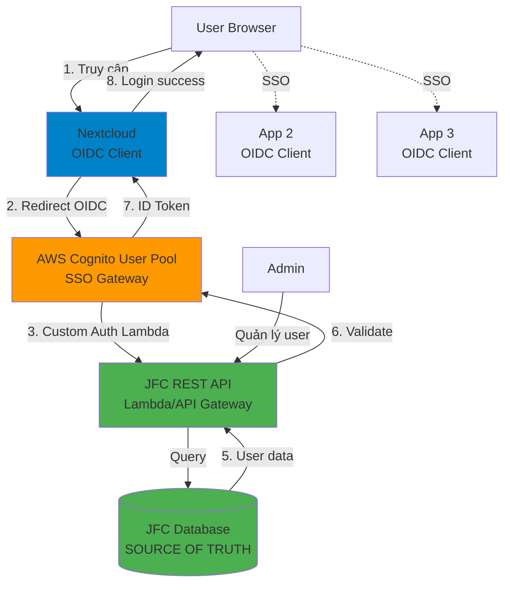

# SSO cho JFC and nextcloud
## Phương án 1: Phát triển JFC thành OpenID Connect Provider (OP)

### Công việc cần làm:
    - Backend (Django)
        - Cài đặt OIDC Provide: Implement các endpoints chuẩn OIDC như /.well-known/openid-configuration, /authorize....
    - NextCloud: - Cài app OpenID Connect Login/ OpenID user backend...
                 - Setting các cấu hình
### Ưu Điểm
- Kiểm soát hoàn toàn: Toàn quyền với user data và authentication flow
- Không phụ thuộc bên thứ 3: Không có chi phí, không bị giới hạn
- Tích hợp chặt chẽ: Dễ dàng customize theo nghiệp vụ
- Single source of truth: User data tập trung tại JFC
- Latency thấp: Không qua trung gian
### Nhược điểm
- Effort cao ban đầu: 3-5 tuần development
- Trách nhiệm bảo mật: Phải tự maintain security (token signing, rotation, etc.)
- Thiếu tính mở rộng: Khó tích hợp thêm apps khác trong tương lai
- Thiếu features enterprise: Không có MFA, user federation, admin UI sẵn
- Testing phức tạp: Cần test compliance với OIDC spec

## Phương án 2: Sử dụng Keycloak làm OP trung gian
            

### Công việc cần làm
- API endpoint xác thực cho Keycloak (xem xét sử dụng /verify đã có sẵn)
- Hai lựa chọn tích hợp Keycloak:
    - Option 1: JFC as Custom User Federation (khuyến nghị)
        - Implement User Storage SPI trong Keycloak
        - Keycloak gọi API JFC để validate credentials
        - User data được sync hoặc query on-demand
    - Option 2: JFC as External Identity Provider
        - Biến JFC thành OIDC/SAML provider đơn giản
        - Keycloak broker tới JFC
        - Effort tương tự phương án 1 nhưng giới hạn scope
- Self host keycloak: 
- Setup Keycloak server (Docker/K8s)
- Cấu hình User Federation hoặc Identity Brokering
- Cài đặt cấu hình next cloud

### Ưu điểm

- Tách biệt concerns: JFC chỉ lo business logic, Keycloak lo authentication
- Features sẵn có: MFA, social login, user federation, admin UI
- Dễ mở rộng: Thêm apps khác chỉ cần config trong Keycloak
- Battle-tested: Keycloak là solution mature, được nhiều tổ chức sử dụng
- Giảm security burden: Keycloak handle token management, session
- Flexibility: Dễ dàng thêm IdP khác (Google, GitHub, LDAP)

### Nhược điểm

- Infrastructure overhead: Cần maintain thêm 1 service (DB, HA, backup)
- Latency tăng: Thêm 1 hop trong authentication flow
- Complexity ban đầu: Learning curve của Keycloak
- Resource consumption: Keycloak khá nặng (RAM ~512MB-1GB)
- Vendor lock-in nhẹ: Nếu cần migrate sang IdP khác cần effort

## Sử dụng nhà cung cấp bên thứ 3

- dùng User Pools làm OIDC Provider.
- Có 3 option:
1. Custom Authentication Lambda : Cognito gọi Lambda để verify với JFC, JFC vẫn là source of truth
2. Cognito lưu user nhưng định kỳ sync từ JFC. (không nên)
3. JFC implement OIDC Provider, Cognito làm identity broker.
- Ưu :
    - Không cần quản lý server, database
    - Auto scaling, high availability
    - AWS lo bảo mật, patches
- Nhược 
    - Customization hạn chế
    - Phức tạp hơn keycloak
    - Phụ thuộc aws lambda
## Price
- MAU (Monthly Active Users) pricing:
    - Tuỳ theo gói: 
        - Lite: First 10,000 (Free-tier)	$0.00, 10,001-100,000 : $0.0055...
        - Plus: Tùy theo region : OSAKA Amazon Cognito Plus costs $0.02 per MAU
        - Essential: First 10,000 (Free-tier)	$0.00, Greater than 10,000 is $0.015 Price per MAU
# NextCloud: 
## Quản lý file:
- Có sẵn hệ thống group/user, phương thức share để kiểm soát quyền truy cập file/folder (giống google drive)
## Talk:
- Talk chat/meeting
- có Tạo meeting, thêm participate => hiển thị calender 
## Custom app:
- nextcloud có hệ thống phát triển app (từ đầu)
- Việc custom app sẵn có thì đang tìm hiểu chưa đánh giá được chính xác độ khó do chưa nắm đc cách xử lý của platform, (có vẻ không dễ như odoo )

# Note
- hai hệ thống là độc lập, chỉ có sử dụng user JFC để xác thực login 
- Có thể cài đặt nếu login ở nextcloud/keycload sẽ login ở JFC (cần xác minh thêm nhưng cũng đang hơi ngược chiều là từ JFC -> Nextcloud)

